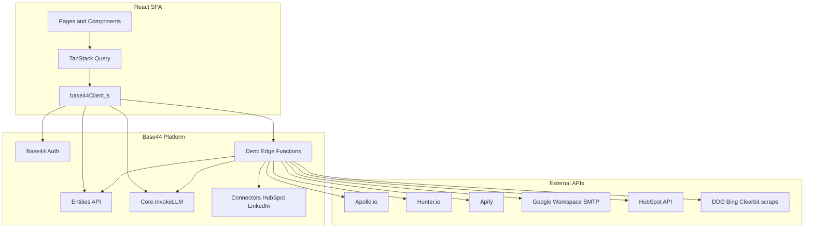
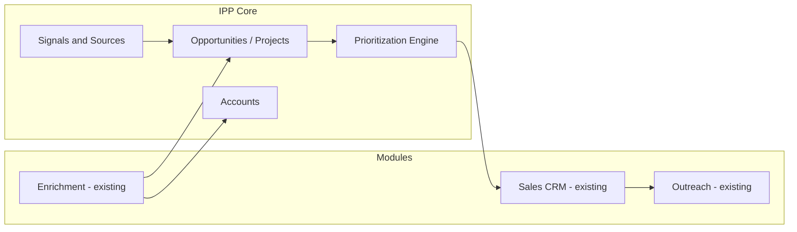

# 02 — Architecture

## System overview

Top-IPP is a **Base44-hosted SPA**: React 18 + Vite 6 + TanStack Query + Tailwind/shadcn, with Deno edge functions under `base44/functions/`.



---

## Folder structure (as inspected)

```
Top-IPP/
├── base44/
│   ├── config.jsonc              # App name: "MoldFlow CRM"
│   ├── connectors/hubspot.jsonc
│   ├── entities/*.jsonc          # Lead, Email*, OutreachCampaign, InboxStats
│   └── functions/*/entry.ts      # 20 edge functions
├── src/
│   ├── api/base44Client.js       # Single SDK client
│   ├── components/               # Domain + ui/ (shadcn)
│   ├── pages/                    # Route screens
│   ├── lib/                      # Auth, query client, app params
│   ├── App.jsx / Layout.jsx
│   └── pages.config.js           # AUTO-GENERATED page registry (partial)
├── package.json                  # name: "base44-app"
└── docs/                         # This audit
```

---

## Architectural layers

| Layer | Location | Role |
|-------|----------|------|
| Presentation | `src/pages`, `src/components` | CRM UI |
| App shell | `App.jsx`, `Layout.jsx`, `AuthContext` | Routing, auth gate, nav |
| Client API | `src/api/base44Client.js` | Single Base44 SDK |
| Domain logic (client) | `leadScoring.jsx`, Pipeline stage tasks, dialogs | Scoring, UX workflows |
| Domain logic (server) | `base44/functions/*` | Enrichment, sync, SMTP, scrape |
| Data | Base44 entities | Persistence |
| AI | `InvokeLLM` (client + server) | Extraction, personalization |

**KEEP:** Layering is recognizable and suitable for a CRM module.

**REFACTOR:** Move toward explicit modules (`crm/`, `enrichment/`, `outreach/`, future `ipp/`) without rewriting.

**REMOVE:** Dual sources of truth for routes; fake integration status in Layout.

---

## Routing architecture

Two registration systems coexist:

1. **Auto registry** — `pages.config.js` registers: Dashboard, Leads, Pipeline, Companies, Integrations.
2. **Manual routes** in `App.jsx` — Tasks, Templates, Outreach, Sequences, EmailOutreach.

| Issue | Severity | Impact | Effort |
|-------|----------|--------|--------|
| Dual routing risks Base44 regenerating `pages.config.js` and omitting manual pages | **High** | Technical / Maintainability | Small |
| Comment says “AUTO-GENERATED / Do not modify PAGES” but manual pages bypass it | **Medium** | Maintainability | Small |

**REFACTOR:** Unify all pages into one registry strategy (either all in `pages.config` or abandon auto-gen).

---

## Client architecture decisions

### Good

- Domain component folders (`leads/`, `outreach/`, `pipeline/`, `dashboard/`).
- TanStack Query for entity lists.
- Shared shadcn `ui/` kit.

### Bad

| Decision | Severity | Impact | Effort |
|----------|----------|--------|--------|
| Fat pages (`Leads`, `LeadDetails`) own many concerns | **Medium** | Maintainability | Large |
| `requiresAuth: false` on SDK client | **High** | Security | Small |
| Branding still “Top Mold CRM” / MoldFlow while repo is Top-IPP | **Medium** | Business | Small |
| Layout hardcodes LinkedIn/HubSpot “Connected” | **Medium** | Business / Technical | Small |

---

## Backend (edge functions) architecture

20 Deno functions. Pattern: `createClientFromRequest` → optional `auth.me()` → `asServiceRole` for entity writes / connectors / LLM.

| Pattern | Assessment |
|---------|------------|
| Service role for automations | **KEEP** (needed for schedulers/webhooks) |
| Auth on some functions only | **REFACTOR** (standardize) |
| Inline prompts in each function | **REFACTOR** (central prompt pack later) |
| Per-function env keys (Apollo, Hunter, Apify, SMTP) | **KEEP** |

---

## Platform coupling

| Coupling | Implication for IPP |
|----------|---------------------|
| Base44 entities + auth + LLM + hosting | Fast delivery; vendor lock-in |
| No portable DB schema in repo | Harder multi-env / multi-tenant IPP |
| Connectors for HubSpot/LinkedIn | Good reuse if contracts fixed |

**KEEP** Base44 as runtime for CRM module short/medium term.  
**REFACTOR** introduce an IPP domain model that can later sit beside Base44 or sync out.

---

## Target IPP architecture (directional — not implementation)



Current code implements **CRM + Enrich + Out** only. **Signals / Opportunities / vertical packs** are missing.

---

## KEEP / REFACTOR / REMOVE (architecture)

| Item | Action |
|------|--------|
| Base44 SPA + edge functions shape | **KEEP** |
| Domain component folders | **KEEP** |
| Enrichment + outreach as modules | **KEEP** (extract clearer boundaries) |
| Dual routing | **REFACTOR** |
| Soft auth client | **REFACTOR** |
| Fat Lead pages | **REFACTOR** (incremental) |
| Fake connection badges | **REMOVE** |
| Unused ProtectedRoute | **REMOVE** |
| Mold-only product framing in shell | **REFACTOR** toward IPP branding when product expands |
