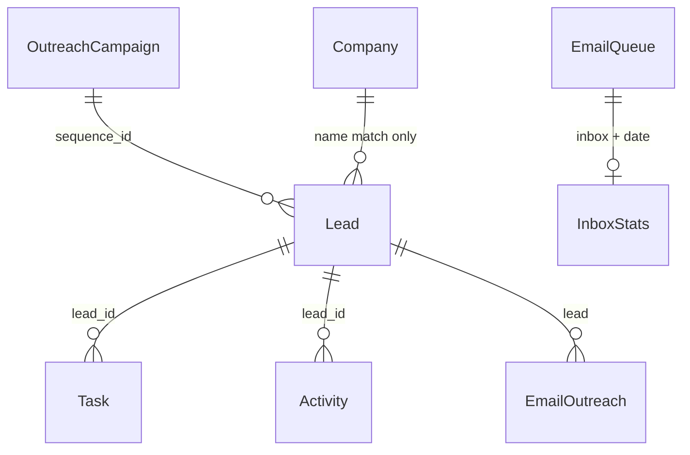

# 03 — Database

## Persistence model

There is **no local Postgres/Supabase/SQLite**. All durable data lives in **Base44 entities**.

In-repo schemas (`base44/entities/`):

| Entity | Purpose | Notes |
|--------|---------|-------|
| **Lead** | Primary CRM object | Rich schema; mold + Apollo + WhatsApp fields |
| **EmailTemplate** | Templates / scripts | ICP metadata, funnel metrics |
| **OutreachCampaign** | Multi-step sequences | Email / LinkedIn steps |
| **EmailOutreach** | Tracked sends | Opens/clicks/`tracking_id` |
| **EmailQueue** | SMTP queue jobs | pending → sent/failed/skipped |
| **InboxStats** | Daily per-inbox counts | **RLS: admin-only** |

Used in code but **missing from repo schemas**:

| Entity | Evidence | Risk |
|--------|----------|------|
| **Company** | `Companies.jsx` | Schema drift; no FK to Lead |
| **Task** | Pipeline, Tasks page, `updateLeadTemperatures` | Schema drift |
| **Activity** | LeadDetails, enrichLead | Schema drift |

| Issue | Severity | Impact | Effort |
|-------|----------|--------|--------|
| Company / Task / Activity not versioned in `base44/entities/` | **High** | Maintainability / Technical | Medium |
| Lead ↔ Company linked by name in UI, not FK | **High** | Business / Technical | Medium |
| No Opportunity / Project / Signal entities for IPP | **Critical** | Business | Large |
| `source: 'hubspot'` written by sync but not in Lead.source enum | **Medium** | Technical | Small |

---

## Lead entity (canonical)

**Required:** `first_name`, `last_name`, `company_name`

**Groups:**

- Contact: email, phone, job_title, linkedin_url, language, location, country  
- Company (denormalized on Lead): company_size, industry, website, company_linkedin, revenue_range, company_description, technologies_used  
- Pipeline: status, source, estimated_value, **mold_potential_value**, priority, icp_score, temperature, trigger_event, tags, notes  
- Cadence: assigned_to, last_contacted, last_activity_date, next_follow_up, next_action, sequence_*  
- Enrichment: apollo_* fields  
- WhatsApp scan: whatsapp_*, website_scan_*

### Pipeline statuses

`new → contacted → qualified → proposal → negotiation → won | lost`

### Temperature

`cold | warm | hot | at_risk | opportunity`

### Sources (enum)

`apollo | linkedin | referral | manual | leadiq | website | trade_show | cold_outreach | other`  
(**Missing:** `hubspot`, scrape-specific sources.)

---

## Relationships (as implemented)

**Bad decision:** Company is a parallel store with weak linkage.  
**KEEP** Lead as CRM contact/deal hybrid short-term.  
**REFACTOR** toward Account + Contact + Opportunity for IPP.

---

## RLS / access control at data layer

Only **InboxStats** declares RLS in-repo (admin CRUD). Other entities rely on Base44 defaults / service role.

| Issue | Severity | Impact | Effort |
|-------|----------|--------|--------|
| Incomplete RLS documentation in repo for Lead/Company/etc. | **High** | Security | Medium |
| Service role bypasses user RLS for many functions | **Medium** | Security | Medium |

---

## IPP data gaps

| Needed for IPP | Present? |
|----------------|----------|
| Opportunity / Project (water, lines, automation, machinery, OEM) | No |
| Vertical / segment taxonomy | No (free-text industry) |
| Signal / trigger feed (tenders, CAPEX, news) | Partial (`trigger_event` string only) |
| Source provenance & confidence | Partial (AIEditDialog confidence; enrich notes) |
| Account hierarchy (HQ / plant / OEM) | No |
| Verification workflow states | No first-class entity |

---

## KEEP / REFACTOR / REMOVE (data)

| Item | Action |
|------|--------|
| Lead + email outreach entities | **KEEP** |
| InboxStats + EmailQueue | **KEEP** |
| mold_potential_value field | **KEEP** (CRM mold module); generalize with vertical-specific value fields later |
| Company as orphan entity | **REFACTOR** (link by id; add schema to repo) |
| Task / Activity cloud-only schemas | **REFACTOR** (commit schemas) |
| HubSpot source enum gap | **REFACTOR** |
| Treating Lead as the only “opportunity” | **REFACTOR** for IPP (new Opportunity entity) |
| Duplicate company fields on Lead forever | **REFACTOR** (denormalized cache OK; source of truth → Account) |
