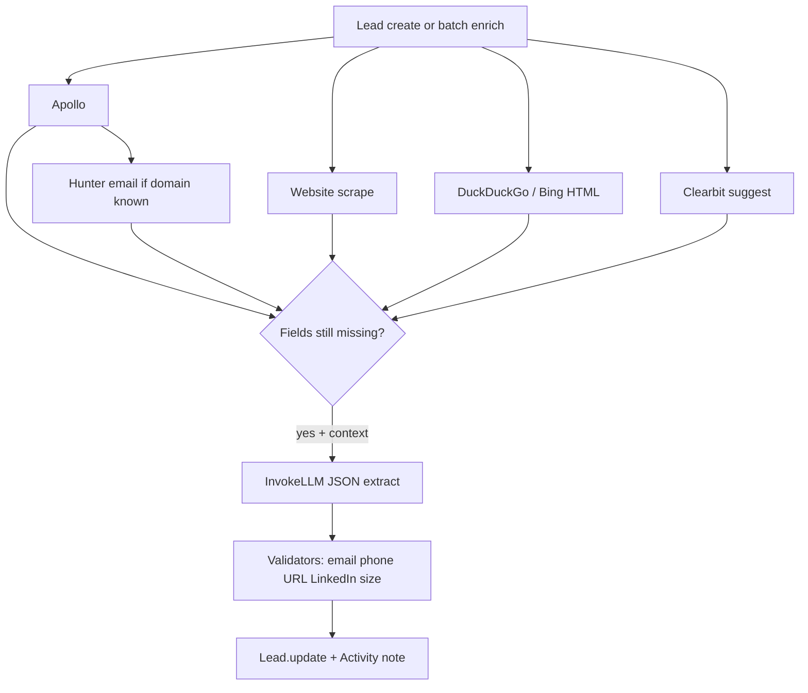

# 05 — AI Pipeline

## Summary

AI is **operational and valuable** for CRM enrichment and outreach personalization. It is **not** an Industrial Intelligence pipeline. There is no dedicated `prompts/` folder, no orchestrator, no evaluation harness, and no continuous opportunity-discovery agent loop.

All LLM calls go through Base44: `integrations.Core.InvokeLLM` (client or `asServiceRole`).

---

## AI call sites

### Client (interactive)

| Location | Purpose | Domain framing |
|----------|---------|----------------|
| `AIEditDialog.jsx` | Field suggestions + confidence/source; web browse | Mold CRM |
| `LeadDetails.jsx` | Enrich missing fields; find decision makers | Mold procurement |
| `LinkedInImport.jsx` | Profile → lead fields | General / mold |
| `PasteLeadDialog.jsx` | Free text → structured lead | Mold |
| `CSVImport.jsx` | Column mapping + enrichment assist | Mold |
| `ComposeEmailDialog.jsx` | Personalize outreach | Mold sales |
| `TestEmailDialog.jsx` | Test personalization | Mold sales |
| `CampaignBuilderDialog.jsx` | Sequence copy | Mold sales |

### Server (automation)

| Function | Purpose |
|----------|---------|
| `enrichLead` | Extract from scrape/search context with validation |
| `apolloEnrich` | LLM fallback when Apollo incomplete |
| `findDecisionMakers` | Mold procurement roles |
| `scrapeLeadsApify` | Extract leads from scraped pages |
| `scanWebsiteWhatsApp` | Assist WhatsApp detection |
| `extractLinkedInProfile` | Profile structuring |

---

## Enrichment pipeline (best path today)

**Hidden gem:** Validation layer in `enrichLead` (banned placeholder emails, LinkedIn regex, company_size enum) — **KEEP** and reuse for IPP.

---

## Prompt architecture assessment

| Aspect | State | Action |
|--------|-------|--------|
| Central prompt library | Absent — prompts inline | **REFACTOR** |
| Versioning / A-B | None | Future |
| Output schemas | Often JSON schema via InvokeLLM | **KEEP** |
| Grounding | Web scrape + search context | **KEEP** |
| Confidence UI | AIEditDialog only | **REFACTOR** (extend) |
| Vertical packs (water, automation…) | None — mold-only | **REFACTOR** for IPP |
| Hallucination controls | Partial validators | **KEEP** / strengthen |

| Issue | Severity | Impact | Effort |
|-------|----------|--------|--------|
| Mold-hardcoded prompts block IPP vertical expansion | **High** | Business | Medium |
| Unbounded client InvokeLLM (cost / rate) | **High** | Performance / Business | Medium |
| Duplicate client vs server enrichment prompts | **Medium** | Maintainability | Medium |
| No eval set for enrichment accuracy | **Medium** | Business / Technical | Medium |

---

## What is missing for IPP AI

1. **Signal ingestion agents** (tenders, CAPEX news, plant expansions, desal RFPs).  
2. **Opportunity classification** into IPP verticals.  
3. **Verification agent** (human-in-the-loop + evidence store).  
4. **Prioritization model** beyond CRM stage/value scoring.  
5. **Continuous scheduled discovery** (not only on-demand scrape).  
6. **Prompt packs per vertical** with shared extraction schemas.

---

## AI readiness score drivers

**Strengths (score ↑):** real multi-source pipeline, JSON schemas, validators, Activity audit notes, outreach personalization.

**Weaknesses (score ↓):** ad-hoc prompts, mold lock-in, cost controls weak, no orchestration/eval, no opportunity intelligence loop.

**AI Readiness: 6.5 / 10** — ready to power CRM enrichment; not ready as IPP brain.

---

## KEEP / REFACTOR / REMOVE (AI)

| Item | Action |
|------|--------|
| enrichLead multi-source + validators | **KEEP** |
| JSON-schema InvokeLLM responses | **KEEP** |
| AIEditDialog confidence/source UX | **KEEP** |
| Mold-specific prompt strings | **REFACTOR** → parameterized vertical packs |
| Scattered client LLM enrichment | **REFACTOR** → server-first |
| Unvalidated free-form LLM writes | **REMOVE** / gate behind validators |
| Notion of “AI = chat over CRM only” | **REFACTOR** toward discovery + verify + prioritize |
