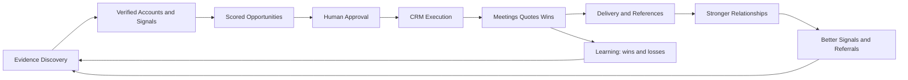

# 11 — Revenue Engine

**Document type:** Strategic business blueprint  
**Audience:** Founders, sales leadership, product, architecture  
**Status:** Implementation-ready specification (no code)  
**Principle:** The Intelligence Engine creates revenue. The CRM executes it.

---

## 1. Mission

IPP exists to **increase the probability of closing high-value industrial projects** by continuously discovering, verifying, qualifying, and prioritizing industrial opportunities — then routing only validated work into sales execution.

We are **industrial solution providers and project integrators**, not the manufacturer of every SKU. We connect industrial buyers with qualified manufacturers, engineering partners, and equipment suppliers — primarily from China — and orchestrate delivery as an integrated commercial solution.

**CRM is not the product.**  
**Qualified industrial opportunity flow is the product.**

---

## 2. Core Philosophy

| Principle | Meaning |
|-----------|---------|
| Evidence over leads | We sell against verified industrial reality, not scraped contact lists. |
| Projects over contacts | Revenue comes from **projects** (CAPEX, lines, plants, OEM programs), not email volume. |
| Relationships compound | Trust built in quiet years unlocks tenders and sole-source conversations later. |
| Verticals are packs | New industries plug in as configuration + sources + scoring weights — not a rewrite. |
| China supply advantage is a capability | Sourcing, OEM/ODM, and integration are part of the offer; intelligence must surface **fit for China-sourced solutions**. |
| Human approval gates revenue risk | AI proposes; commercial judgment disposes before CRM pollution. |
| Every metric must map to close probability | Vanity CRM stats are secondary to pipeline quality and revenue influenced. |

**North-star question for every feature:**  
*Does this increase the chance we win an industrial project in the next 3–18 months?*

---

## 3. Revenue Strategy

### 3.1 How money is made

Revenue is generated when IPP-enabled commercial motion results in:

1. **Project wins** — equipment, lines, molds, plants, automation packages, OEM programs.  
2. **Integration / project management fees** — coordinating multi-supplier delivery.  
3. **Sourcing / OEM-ODM programs** — recurring or multi-year manufacturing partnerships.  
4. **Repeat / expansion** — second line, spare capacity, aftermarket, sister plant.

Intelligence does not invoice. Intelligence **raises win rate, shortens cycle, and increases average project value** by putting the right opportunity in front of the right person at the right time with the right China-side capability.

### 3.2 Commercial motion (layers)

```text
DISCOVER evidence → VERIFY → SCORE → APPROVE → RELATE / ENGAGE → QUALIFY PROJECT → PROPOSAL → WIN
                                      ↑
                               CRM = execution layer only
```

| Layer | Owner | Output |
|-------|-------|--------|
| Discovery & verification | Intelligence Engine | Evidence + signals + draft opportunities |
| Relationship | Sales + content | Warm accounts even without open CAPEX |
| Opportunity pursuit | Sales / BD | Qualified projects in CRM |
| Delivery / sourcing | Ops + China partners | Fulfilled project → revenue |

### 3.3 What we sell (offer framing)

Not “plastic molds” alone — **capability bundles**:

- Design → manufacture → ship → install → commission (as applicable)  
- China manufacturer match + quality gate + commercial terms  
- Multi-equipment packages (e.g. water + packaging + automation)  
- OEM/ODM program setup for brand owners

### 3.4 Revenue strategy rules

1. **Prioritize project-shaped opportunities** over single-SKU tire-kickers.  
2. **Protect inbox quality** — CRM only receives approved intelligence.  
3. **Invest in relationship scores** for strategic accounts in each vertical.  
4. **Expand verticals** that share: CAPEX, plant decision makers, China supply fit.  
5. **Measure revenue influenced**, not only emails sent.

---

## 4. Revenue Flywheel



### Flywheel stages

| Stage | What compounds |
|-------|----------------|
| Discovery | More sources → more evidence |
| Verification | Higher confidence → less wasted sales time |
| Scoring | Better prioritization → higher win rate |
| Relationship | Trust → earlier awareness of projects |
| Wins | Case studies → credibility in adjacent verticals |
| Learning | Rejected false positives → cleaner future discovery |

**Break the flywheel:** flooding CRM with unverified “leads.”  
**Protect the flywheel:** Intelligence Inbox + approval.

---

## 5. Industrial Verticals

Architecture rule: each vertical is a **Vertical Pack** (taxonomy, sources, buyers, triggers, scoring weights, content). The engine stays the same.

### 5.1 Industrial Water & Desalination / RO Systems

| Dimension | Detail |
|-----------|--------|
| **Typical products** | RO/UF/NF skids, pretreatment, dosing, CIP, brine handling, desalination trains, ZLD packages, pumps, membranes (sourced), containersized plants |
| **Typical customers** | Municipal utilities, industrial plants (F&B, pharma, chemicals, mining, power), hotels/resorts, EPC water contractors, industrial parks |
| **Typical project value** | USD 50k–500k (skids); USD 0.5M–15M+ (plant trains / municipal) |
| **Sales cycle** | 3–18 months (industrial); 6–36 months (municipal / EPC) |
| **Main decision makers** | Operations Director, Plant Manager, Utility GM, Project Director |
| **Technical influencers** | Process / water engineers, consultants, EPC process leads |
| **Procurement influencers** | Procurement Manager, government tender boards, EPC commercial |
| **Buying triggers** | Water scarcity, discharge regulation, plant expansion, tourism CAPEX, ESG/water reuse mandates |
| **Buying signals** | Environmental permits, tender notices, new factory water demand, hiring water treatment engineers, desalination news, industrial park announcements |
| **Sales strategy** | Lead with process fit + lifecycle cost; partner with EPCs; China-sourced skids with documented quality; early consultant engagement |

### 5.2 Complete Production Lines

| Dimension | Detail |
|-----------|--------|
| **Typical products** | Turnkey or semi-turnkey lines (food, beverage, plastics conversion, packaging-integrated lines) |
| **Typical customers** | Brand owners, contract manufacturers, new plant investors, industrial park tenants |
| **Typical project value** | USD 0.3M–20M+ |
| **Sales cycle** | 6–24 months |
| **Main decision makers** | Owner, CEO, Operations Director, Project Manager |
| **Technical influencers** | Engineering Director, process consultants, OEM line engineers |
| **Procurement influencers** | Purchasing Director, finance for CAPEX approval |
| **Buying triggers** | New plant, capacity shortage, new product SKU, nearshoring, cost reduction vs EU/US OEMs |
| **Buying signals** | Construction permits, investment announcements, hiring production engineers, trade-show “new line” claims, land acquisition for factories |
| **Sales strategy** | Position as integrator + China OEM network; phased CAPEX; factory acceptance tests; reference visits |

### 5.3 Food Processing Plants

| Dimension | Detail |
|-----------|--------|
| **Typical products** | Processing equipment, hygiene systems, CIP, freezing/cooking lines, packaging interfaces, utility packages |
| **Typical customers** | Food producers, co-packers, agricultural processors, investors in greenfield plants |
| **Typical project value** | USD 200k–10M+ |
| **Sales cycle** | 4–18 months |
| **Main decision makers** | Owner, Plant Manager, Operations Director |
| **Technical influencers** | Food technologists, QA/hygiene managers, engineering |
| **Procurement influencers** | Procurement, sometimes government agri-funds |
| **Buying triggers** | Export certification, new recipes/capacity, food safety incidents, cold-chain expansion |
| **Buying signals** | HACCP/ISO food cert news, plant expansion, hiring QA/maintenance, food park investments |
| **Sales strategy** | Compliance + hygiene narrative; China cost with FAT/SAT rigor; package utilities + process |

### 5.4 Beverage Production

| Dimension | Detail |
|-----------|--------|
| **Typical products** | Filling, blowing, mixing, pasteurization, water treatment for beverage, packaging lines |
| **Typical customers** | Beverage brands, bottlers, contract fillers |
| **Typical project value** | USD 150k–8M+ |
| **Sales cycle** | 4–18 months |
| **Main decision makers** | Operations Director, Plant Manager, Owner |
| **Technical influencers** | Process engineers, packaging engineers |
| **Procurement influencers** | Purchasing Director |
| **Buying triggers** | New SKU, PET line upgrade, market expansion, water quality issues |
| **Buying signals** | New product launches, capacity hiring, packaging upgrade RFPs, water treatment tenders |
| **Sales strategy** | Line throughput + TCO; combine water + filling + packaging offers |

### 5.5 Plastic Injection Molds

| Dimension | Detail |
|-----------|--------|
| **Typical products** | Injection molds, multi-cavity tooling, hot runner systems, mold design |
| **Typical customers** | Plastic product OEMs, automotive suppliers, consumer goods, medical plastics (select) |
| **Typical project value** | USD 5k–250k per mold; programs higher |
| **Sales cycle** | 2–9 months |
| **Main decision makers** | Engineering Director, Purchasing, Owner (SME) |
| **Technical influencers** | Tooling engineers, product designers |
| **Procurement influencers** | Procurement Manager |
| **Buying triggers** | New product launch, mold end-of-life, dual-sourcing from China, cost-down |
| **Buying signals** | New product patents/launches, hiring tooling engineers, trade shows, RFQs |
| **Sales strategy** | Design capability + steel/spec transparency + sample/T1 discipline; existing CRM strength **KEEP** as vertical pack |

### 5.6 Plastic Products (parts / finished goods)

| Dimension | Detail |
|-----------|--------|
| **Typical products** | Injection-molded parts, assemblies, OEM plastic goods |
| **Typical customers** | Brand owners seeking OEM/ODM, importers, distributors |
| **Typical project value** | USD 20k–2M+ annualized programs |
| **Sales cycle** | 3–12 months to first PO; then recurring |
| **Main decision makers** | Owner, Purchasing Director, Product Manager |
| **Technical influencers** | Quality / tooling / design |
| **Procurement influencers** | Procurement, supply chain |
| **Buying triggers** | Cost pressure, supplier failure, new SKU, China dual-source |
| **Buying signals** | Import data shifts, RFQs, LinkedIn “sourcing manager” hires |
| **Sales strategy** | OEM/ODM program selling; tooling + unit price economics |

### 5.7 Factory Automation

| Dimension | Detail |
|-----------|--------|
| **Typical products** | Conveyors, robotics cells, PLC/SCADA packages, pick-and-place, AGV (select), inspection systems |
| **Typical customers** | Manufacturers upgrading plants, new factories, system integrators |
| **Typical project value** | USD 50k–5M+ |
| **Sales cycle** | 3–15 months |
| **Main decision makers** | Operations Director, Engineering Director, Plant Manager |
| **Technical influencers** | Automation engineers, maintenance, SI partners |
| **Procurement influencers** | Procurement, CAPEX committee |
| **Buying triggers** | Labor shortage, quality variation, throughput goals, Industry 4.0 grants |
| **Buying signals** | Hiring automation engineers, grant awards, expansion permits, trade-show demos |
| **Sales strategy** | ROI / labor payback; partner with local SIs; China hardware + local commissioning plan |

### 5.8 Industrial Machinery

| Dimension | Detail |
|-----------|--------|
| **Typical products** | Specialty machines, CNC-adjacent equipment, process machinery by vertical |
| **Typical customers** | Plants replacing obsolete machines, greenfield projects |
| **Typical project value** | USD 30k–3M+ |
| **Sales cycle** | 2–12 months |
| **Main decision makers** | Plant Manager, Engineering, Owner |
| **Technical influencers** | Maintenance Manager, production engineering |
| **Procurement influencers** | Purchasing |
| **Buying triggers** | Breakdown risk, capacity, energy efficiency, safety compliance |
| **Buying signals** | Maintenance hiring, energy audits, machinery RFQs, used-equipment sell-offs |
| **Sales strategy** | Spec match + spare parts plan + training; China OEM with warranty structure |

### 5.9 Packaging Equipment

| Dimension | Detail |
|-----------|--------|
| **Typical products** | Wrappers, cartoners, case packers, labelers, palletizers |
| **Typical customers** | F&B, CPG, pharma packaging, contract packers |
| **Typical project value** | USD 40k–2M+ |
| **Sales cycle** | 3–12 months |
| **Main decision makers** | Operations, Packaging Manager, Plant Manager |
| **Technical influencers** | Packaging engineers, OEMs’ application engineers |
| **Procurement influencers** | Procurement |
| **Buying triggers** | New pack formats, speed upgrades, e-commerce fulfillment, sustainability pack changes |
| **Buying signals** | New product launches, packaging engineer hires, tender for packing lines |
| **Sales strategy** | Format flexibility + changeover time; bundle with production line deals |

### 5.10 Wind Turbines (10–50 kW)

| Dimension | Detail |
|-----------|--------|
| **Typical products** | Small wind turbines, towers, controllers, hybrid solar-wind kits |
| **Typical customers** | Farms, remote industrial sites, resorts, NGOs, municipal pilots, distributors |
| **Typical project value** | USD 15k–400k per installation / micro-fleet |
| **Sales cycle** | 2–12 months |
| **Main decision makers** | Owner, Facility Manager, Energy Manager, government program leads |
| **Technical influencers** | Electrical consultants, EPC renewables |
| **Procurement influencers** | Procurement, grant administrators |
| **Buying triggers** | Energy cost, off-grid need, green grants, ESG |
| **Buying signals** | Renewable tenders, rural electrification programs, hybrid microgrid news |
| **Sales strategy** | Site feasibility honesty; certification/compliance; distributor channels + project deals |

### 5.11 OEM / ODM Manufacturing & China Manufacturing Partnerships

| Dimension | Detail |
|-----------|--------|
| **Typical products** | Contract manufacturing, private label, jointly developed products, supply partnerships |
| **Typical customers** | Brands, inventors, importers, industrial buyers seeking dual source |
| **Typical project value** | USD 50k–5M+ program value |
| **Sales cycle** | 3–18 months to stable supply |
| **Main decision makers** | CEO/Owner, Purchasing Director, Supply Chain |
| **Technical influencers** | Quality, NPI engineers |
| **Procurement influencers** | Procurement, legal (contracts) |
| **Buying triggers** | Tariff/cost, supplier risk, new product industrialization |
| **Buying signals** | Sourcing trips, China visit announcements, RFQs, LinkedIn sourcing roles |
| **Sales strategy** | Trust + audit trail + IP protection narrative; factory matching as IPP core value |

### 5.12 Vertical pack extensibility

To add a vertical without redesign:

1. Define products, buyers, triggers, signals.  
2. Attach source list + reliability weights.  
3. Set Strategic Fit weights (China supply fit, ticket size, cycle).  
4. Add content/newsletter topics.  
5. Do **not** fork the discovery workflow.

---

## 6. Buyer Personas

### 6.1 CEO

| | |
|--|--|
| **Responsibilities** | Strategy, capital allocation, partnerships |
| **Pain points** | Growth vs risk; unreliable suppliers; long payback uncertainty |
| **Buying authority** | Final on large CAPEX / strategic OEM |
| **Information sources** | Peers, boards, advisors, major news, trusted BD intros |
| **Typical objections** | “Too risky / too China / not strategic now” |
| **Recommended communication** | Brief, outcome-led, references, risk mitigation, optionality |

### 6.2 Owner (SME / family business)

| | |
|--|--|
| **Responsibilities** | All major spend; personal capital at risk |
| **Pain points** | Cash flow, trust, complexity |
| **Buying authority** | Absolute |
| **Information sources** | Trade shows, WhatsApp networks, referrals |
| **Typical objections** | Price fear; “need to see factory” |
| **Recommended communication** | Personal trust, photos/FAT videos, staged payments, clear next step |

### 6.3 Operations Director

| | |
|--|--|
| **Responsibilities** | Throughput, cost/unit, uptime, multi-plant ops |
| **Pain points** | Bottlenecks, labor, quality drift |
| **Buying authority** | Strong influencer; often CAPEX sponsor |
| **Information sources** | Plant KPIs, peer plants, industry forums |
| **Typical objections** | Integration risk; downtime during install |
| **Recommended communication** | ROI, installation plan, uptime case studies |

### 6.4 Plant Manager

| | |
|--|--|
| **Responsibilities** | Daily production, maintenance coordination, local CAPEX proposals |
| **Pain points** | Breakdowns, spare parts, training gaps |
| **Buying authority** | Medium; initiates needs |
| **Information sources** | Shop floor, OEM manuals, local reps |
| **Typical objections** | “Operators won’t adapt”; spare parts lead time |
| **Recommended communication** | Practical, spare strategy, training, local support plan |

### 6.5 Engineering Director

| | |
|--|--|
| **Responsibilities** | Specs, technology selection, vendor technical shortlist |
| **Pain points** | Spec uncertainty; poor documentation; non-compliant equipment |
| **Buying authority** | High on technical veto |
| **Information sources** | Datasheets, standards, consultants, LinkedIn peers |
| **Typical objections** | Incomplete specs; certification gaps |
| **Recommended communication** | Detailed specs, drawings, standards matrix, engineer-to-engineer |

### 6.6 Project Manager

| | |
|--|--|
| **Responsibilities** | Timeline, budget, vendors for a defined project |
| **Pain points** | Schedule slip, interface gaps, unclear scope |
| **Buying authority** | Medium–high within project budget |
| **Information sources** | Project docs, EPC packages, tender docs |
| **Typical objections** | Lead time; unclear milestones |
| **Recommended communication** | Milestone plan, RACI, interface list, FAT/SAT schedule |

### 6.7 Maintenance Manager

| | |
|--|--|
| **Responsibilities** | Reliability, spares, MTTR |
| **Pain points** | Unavailable spares; poor maintainability |
| **Buying authority** | Influencer; veto on unmaintainable kit |
| **Information sources** | CMMS history, technician feedback |
| **Typical objections** | Proprietary parts lock-in |
| **Recommended communication** | Spares kits, maintainability, documentation quality |

### 6.8 Production Manager

| | |
|--|--|
| **Responsibilities** | Output, quality yield, line balance |
| **Pain points** | Changeover, scrap, speed |
| **Buying authority** | Influencer |
| **Information sources** | Shift data, supervisors |
| **Typical objections** | Learning curve; quality risk |
| **Recommended communication** | Throughput demos, changeover times, yield cases |

### 6.9 Procurement Manager

| | |
|--|--|
| **Responsibilities** | RFQ process, vendor comparison, terms |
| **Pain points** | Incomplete quotes; Incoterms; compliance paperwork |
| **Buying authority** | Process control; not always final |
| **Information sources** | ERP, vendor portals, peer procurement |
| **Typical objections** | Price; payment terms; single-source fear |
| **Recommended communication** | Clean RFQ response, TCO, terms options, dual-source story |

### 6.10 Purchasing Director

| | |
|--|--|
| **Responsibilities** | Category strategy, supplier panel, large awards |
| **Pain points** | Supply risk, audit burden, geopolitics |
| **Buying authority** | High on supplier selection |
| **Information sources** | Market intel, audits, finance |
| **Typical objections** | China risk; IP; quality systems |
| **Recommended communication** | Audit trail, quality system, escrow/staged payment, references |

### 6.11 Technical Director

| | |
|--|--|
| **Responsibilities** | Technology roadmap, standards, architecture of plants |
| **Pain points** | Obsolescence; integration standards |
| **Buying authority** | Strong technical gate |
| **Information sources** | Standards bodies, conferences, white papers |
| **Typical objections** | “Not innovative enough” or “too unproven” |
| **Recommended communication** | Architecture fit, standards, roadmap partnership |

### 6.12 Government Procurement

| | |
|--|--|
| **Responsibilities** | Compliant tendering, public value, local content rules |
| **Pain points** | Procedure rigidity; bid disqualification |
| **Buying authority** | Formal award power within rules |
| **Information sources** | Official portals, gazettes |
| **Typical objections** | Documentation; eligibility; local partner requirements |
| **Recommended communication** | Tender-perfect packs; local partner model; compliance checklist |

### 6.13 EPC Contractors

| | |
|--|--|
| **Responsibilities** | Design-build delivery; subcontract packages |
| **Pain points** | Vendor reliability; interface risk; margin pressure |
| **Buying authority** | Package award within project |
| **Information sources** | Bid docs, past vendors, owner preferences |
| **Typical objections** | Performance risk; liquidated damages |
| **Recommended communication** | Partnership terms, performance bonds where needed, clear scope boundaries |

### 6.14 System Integrators

| | |
|--|--|
| **Responsibilities** | Integrate multi-vendor systems; commissioning |
| **Pain points** | Hardware quality; support responsiveness |
| **Buying authority** | Specify / recommend equipment |
| **Information sources** | Vendor tech, project experience |
| **Typical objections** | Support in-country |
| **Recommended communication** | Co-sell model; margin for SI; joint commissioning plan |

### 6.15 Consultants

| | |
|--|--|
| **Responsibilities** | Advise owners/EPCs on technology and vendors |
| **Pain points** | Reputation risk if vendor fails |
| **Buying authority** | Indirect but decisive |
| **Information sources** | Studies, peers, site visits |
| **Typical objections** | Insufficient references |
| **Recommended communication** | Educate; share evidence packs; never oversell |

---

## 7. Relationship Strategy

Long-term revenue requires **presence without pressure** when no CAPEX is open.

### 7.1 Goals

- Stay the default China-integration partner when a project appears.  
- Accumulate Relationship Score before Opportunity Score.  
- Convert trust into early RFQ inclusion.

### 7.2 Newsletter strategy

| Element | Spec |
|---------|------|
| Cadence | Monthly (vertical-specific editions preferred) |
| Content mix | 40% education, 30% project/case patterns, 20% China supply insights, 10% soft CTA |
| Segmentation | By vertical pack + persona (ops vs engineering vs procurement) |
| CTA | Low-friction: “request capability brief”, not hard sell |
| Measurement | Open → site evidence engagement → reply → meeting |

### 7.3 Educational content

- Process primers (RO pretreatment mistakes; mold steel selection; line FAT checklists).  
- Comparison frameworks (TCO, energy, hygiene).  
- Checklists for tenders and factory audits.  
- Short videos from factory FAT (with permission).

### 7.4 Trade show follow-up

1. Capture booth scans / cards as **evidence**, not instant CRM spam.  
2. 48-hour personalized follow-up referencing booth context.  
3. 14-day value send (relevant one-pager).  
4. 60-day relationship touch if no project.  
5. Tag vertical + persona + Relationship Score bump.

### 7.5 Quarterly contact

For accounts with Relationship Score ≥ threshold and no open opportunity:

- Quarterly check-in: capacity plans, shutdown windows, upcoming CAPEX themes.  
- Ask one intelligence question (feeds Discovery).  
- Offer one useful asset.

### 7.6 Relationship score (summary)

See §9. Used to prioritize nurturing vs pursuit.

### 7.7 Customer lifecycle

```text
Unknown → Observed Account → Verified Account → Nurtured Relationship
    → Active Opportunity → Proposal → Won Customer → Expansion / Advocate
                                    ↘ Lost / No-decision → Nurture again
```

| Stage | Commercial posture |
|-------|--------------------|
| Observed | Discover only |
| Verified | Light nurture |
| Nurtured | Quarterly + content |
| Active Opportunity | CRM execution |
| Won | Delivery excellence + reference ask |
| Advocate | Referrals + joint case studies |

---

## 8. Opportunity Strategy

### 8.1 How opportunities are discovered

Via Discovery Engine (Document 12): evidence from web, tenders, permits, news, hiring, trade shows, imports, CRM history, referrals — **never invented**.

### 8.2 How opportunities are qualified

Minimum viable opportunity (MVO) requires:

| Gate | Requirement |
|------|-------------|
| Account real | Verified company existence |
| Project-shaped | CAPEX / program / tender / expansion — not “maybe interested” |
| Vertical fit | Maps to an active Vertical Pack |
| Timing window | Signal freshness within policy |
| Stakeholder path | At least one plausible decision path (persona class) |
| Offer fit | China-sourced / integration offer can address need |

### 8.3 How opportunities are prioritized

Combine:

1. **Opportunity Score** — project attractiveness & urgency  
2. **Strategic Fit Score** — fit to our offer & China capability  
3. **Relationship Score** — access & trust  

**Priority index (conceptual):**  
`Priority = 0.45·Opportunity + 0.35·StrategicFit + 0.20·Relationship`  
(weights tunable per vertical).

### 8.4 How they move into CRM

```text
Intelligence Inbox → Human (or policy) Approval → CRM Opportunity + Account + Contact(s)
```

CRM receives:

- Linked evidence IDs  
- Scores snapshot  
- Vertical + signal tags  
- Recommended next action  

**Rule:** No approved evidence trail → does not enter CRM as a sales opportunity.

---

## 9. Revenue Scoring

Three **independent** scores (0–100). Never collapse into one until prioritization.

### 9.1 Relationship Score (0–100)

Measures **access and trust** with an account (and key personas), independent of whether a project is open.

| Factor | Points (max) | How calculated |
|--------|-------------:|----------------|
| Verified decision-maker contacts | 20 | +5 per verified DM persona (cap 20) |
| Engagement recency | 20 | Contact/email/meeting in last 14d=20; 30d=15; 90d=8; 180d=3; else 0 |
| Engagement depth | 15 | Meeting held=15; reply thread=10; open-only=3 |
| Content affinity | 10 | Newsletter/content clicks on relevant vertical (capped) |
| Tenure of relationship | 10 | Account known >24mo=10; >12=7; >6=4; else 2 |
| Referral / intro strength | 10 | Warm intro from trusted party=10; trade-show meet=6 |
| Delivery / commercial history | 15 | Past win=15; past quote=8; past meeting only=3 |
| **Total** | **100** | Sum, capped at 100 |

**Decay:** −5 per 90 days with zero meaningful touch (floor 0).  
**Never invent contacts to inflate this score.**

### 9.2 Opportunity Score (0–100)

Measures **strength of the project signal** and commercial upside.

| Factor | Points (max) | How calculated |
|--------|-------------:|----------------|
| Evidence strength | 25 | Multi-source verified=25; dual=18; single high-trust=12; single low-trust=5 |
| Signal intensity | 20 | Tender/permit/funded project=20; expansion news=15; hiring cluster=10; soft mention=5 |
| Estimated value band | 20 | >$2M=20; $500k–2M=15; $100–500k=10; <$100k=5; unknown=3 |
| Timing / urgency | 15 | Active tender/deadline=15; <6mo likely=10; 6–18mo=6; speculative=2 |
| Stakeholder clarity | 10 | Named DM verified=10; role known=6; company-only=2 |
| Competitive openness | 10 | Open RFQ/tender=10; exclusive incumbent likely=3 |
| **Total** | **100** | |

### 9.3 Strategic Fit Score (0–100)

Measures **fit to our integrator + China supply model**.

| Factor | Points (max) | How calculated |
|--------|-------------:|----------------|
| Vertical pack match | 25 | Active focus vertical=25; adjacent=12; out-of-scope=0 |
| Offer capability match | 25 | Can fulfill via known OEM network=25; partial=12; cannot=0 |
| China supply suitability | 20 | Strong cost/capability fit=20; constrained (cert/local-content)=8; poor fit=0 |
| Geography / logistics feasibility | 10 | Serviceable region=10; difficult=4 |
| Ticket size attractiveness | 10 | In target band for vertical=10; too small=3; too large/unrealistic=5 |
| Partnership path | 10 | EPC/SI/consultant path exists=10; direct only=5 |
| **Total** | **100** | |

### 9.4 Score governance

- Scores are **recomputed** when evidence/signals/relationships change.  
- Snapshots stored at Approval → CRM promotion.  
- Sales may override priority with reason (feeds learning).

---

## 10. KPIs (Business Engine Metrics)

Replace vanity CRM metrics as the primary dashboard.

### 10.1 Intelligence productivity

| KPI | Definition |
|-----|------------|
| Verified companies | Accounts passing verification policy |
| Verified decision makers | Personas with evidence-backed identity (no invented emails) |
| Buying signals (new) | New signal records per period |
| Projects discovered | Distinct project-shaped opportunities detected |
| Evidence freshness | % evidence within expiry policy |
| Average confidence | Mean confidence of approved opportunities |

### 10.2 Funnel quality

| KPI | Definition |
|-----|------------|
| Qualified opportunities | Passed MVO + approval |
| Inbox acceptance rate | Approved / (Approved + Rejected) |
| False positive rate | Rejected for “not real / not project” |
| Time discovery → approval | Median hours/days |
| Time approval → first meeting | Median |

### 10.3 Commercial outcomes

| KPI | Definition |
|-----|------------|
| Pipeline value | Sum of estimated values on qualified opps |
| Meetings booked | From approved intelligence |
| Quotes submitted | Formal commercial offers |
| Win rate | Won / (Won + Lost) on IPP-sourced opps |
| Average response time | First meaningful sales response after approval |
| Revenue influenced | Closed revenue tagged to IPP opportunity IDs |
| Cycle time | Approval → close |

### 10.4 Relationship health

| KPI | Definition |
|-----|------------|
| Accounts in nurture | Relationship Score ≥ threshold, no open opp |
| Quarterly coverage | % strategic accounts touched last 90 days |
| Newsletter engagement by vertical | Segmented |

### 10.5 What we de-emphasize as primary KPIs

Emails sent, dials, raw “leads created,” scraped contact counts — useful operationally, **not** success metrics for IPP.

---

## Closing directive

The Revenue Engine succeeds when **verified industrial projects** flow into a disciplined CRM execution layer, relationships compound between projects, and every vertical pack increases close probability without architectural redesign.

**Next document:** `12_DISCOVERY_ENGINE.md` — how evidence and signals enter the system.
