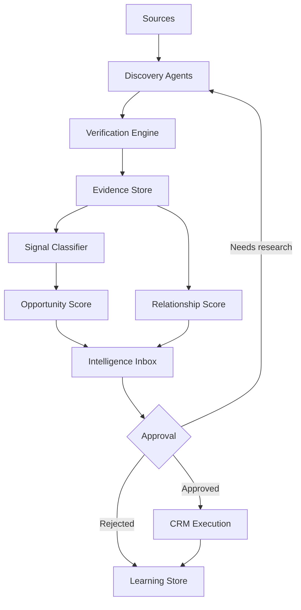

# 12 — Discovery Engine

**Document type:** Intelligence architecture & AI agent specification  
**Audience:** CTO, AI/product engineering, intelligence analysts, sales ops  
**Status:** Implementation-ready blueprint (no code)  
**Depends on:** `11_REVENUE_ENGINE.md`  
**Principle:** The platform NEVER generates leads. The platform discovers **evidence**.

---

## 1. Discovery Philosophy

### 1.1 Evidence-first doctrine

| Forbidden | Required |
|-----------|----------|
| Invent companies | Discover companies from sources |
| Invent contacts / emails / phones | Extract only when present in evidence; else mark **unknown** |
| Invent projects | Infer project **hypotheses** only from signals + evidence |
| “Lead gen” scraping as success | Verified evidence → signals → scored opportunities |
| Auto-push to CRM | Intelligence Inbox → approval → CRM |

### 1.2 Definitions

| Term | Meaning |
|------|---------|
| **Evidence** | An attributable artifact (URL, document, registry row, import record) that supports a fact |
| **Signal** | A classified buying indicator derived from one or more evidence items |
| **Account** | A real-world organization (normalized) |
| **Opportunity hypothesis** | A project-shaped interpretation of signals (pre-approval) |
| **Opportunity** | Approved hypothesis promoted to CRM execution |

### 1.3 Design goals

1. Continuous, not campaign-based.  
2. Multi-source, confidence-weighted.  
3. Vertical-pack configurable.  
4. AI assists extraction/classification — **never fabricates**.  
5. Humans (or strict policies) approve before CRM.  
6. Every accept/reject trains the system.

### 1.4 Relationship to existing CRM (KEEP)

Current Top-IPP CRM (enrichment, outreach, pipeline) remains the **execution layer**. Discovery Engine sits **upstream** and must not be collapsed into Lead.create from raw scrape.

---

## 2. Discovery Workflow

```text
Internet / Registries / Partners / Internal Systems
        ↓
   DISCOVERY (collect candidate artifacts)
        ↓
   VERIFICATION (entity resolution + multi-source checks)
        ↓
   EVIDENCE (normalized, scored, dated, linked)
        ↓
   BUYING SIGNALS (taxonomy classification)
        ↓
   OPPORTUNITY SCORE (+ Strategic Fit)
        ↓
   RELATIONSHIP SCORE (account graph)
        ↓
   INTELLIGENCE INBOX (work queue for humans/policies)
        ↓
   APPROVAL (accept / reject / needs-research)
        ↓
   CRM (Account + Opportunity + Contacts only if evidenced)
```



### 2.1 Stage contracts

| Stage | Input | Output | AI may | AI must not |
|-------|-------|--------|--------|-------------|
| Discovery | Source configs | Raw artifacts | Fetch, parse, dedupe candidates | Invent URLs/facts |
| Verification | Artifacts | Verified entities + conflicts | Match, normalize, weight | Merge incompatible entities blindly |
| Evidence | Verified facts | Evidence records | Summarize, tag | Add unsourced claims |
| Signals | Evidence | Signal instances | Classify taxonomy | Create signal without evidence link |
| Scoring | Signals + account | Scores | Calculate per formula | Override business rules silently |
| Inbox | Scored packs | Queue items | Rank, recommend action | Auto-create CRM opps (unless policy) |
| Approval | Human/policy | Decision | — | Skip audit trail |
| CRM | Approved pack | Sales objects | — | Create contacts without evidence |

---

## 3. Discovery Sources

Each source is configured per Vertical Pack with reliability weight `W` (0–1).

### 3.1 Official company websites

| | |
|--|--|
| **Reliability** | High for self-description; medium for “plans” |
| **Advantages** | Products, plants, contacts pages, newsrooms |
| **Limitations** | Marketing fluff; outdated pages |
| **Confidence** | Base 0.70–0.85 for firmographics; lower for future projects |
| **Use** | Account verification, product fit, WhatsApp/web contact **only if published** |

### 3.2 Government registries

| | |
|--|--|
| **Reliability** | Very high for legal existence |
| **Advantages** | Legal name, status, officers (jurisdiction-dependent) |
| **Limitations** | Sparse project data; access varies by country |
| **Confidence** | 0.90–0.98 for existence |
| **Use** | Entity resolution backbone |

### 3.3 Trade show exhibitors

| | |
|--|--|
| **Reliability** | High that company participates; medium for buying intent |
| **Advantages** | Active market players; vertical clustering |
| **Limitations** | Exhibitors ≠ buyers; lists incomplete |
| **Confidence** | 0.75 presence; 0.40–0.60 as buyer signal alone |
| **Use** | Account discovery + relationship entry + weak signal “market active” |

### 3.4 Industrial associations

| | |
|--|--|
| **Reliability** | Medium–high membership lists |
| **Advantages** | Vertical targeting |
| **Limitations** | Paywalls; stale directories |
| **Confidence** | 0.70 membership |
| **Use** | Account universe building |

### 3.5 Tender portals

| | |
|--|--|
| **Reliability** | Very high for demand events |
| **Advantages** | Explicit scope, deadlines, values sometimes |
| **Limitations** | Competition; eligibility barriers; document burden |
| **Confidence** | 0.90–0.98 as opportunity signal |
| **Use** | Top-tier Opportunity Score input |

### 3.6 News

| | |
|--|--|
| **Reliability** | Medium (varies by outlet) |
| **Advantages** | Expansions, investments, accidents, leadership |
| **Limitations** | Errors, PR spin, duplicates |
| **Confidence** | 0.50–0.80 by outlet tier |
| **Use** | Signals; always seek corroboration |

### 3.7 Press releases

| | |
|--|--|
| **Reliability** | High that company claims X; medium that X is funded |
| **Advantages** | First-party intent language |
| **Limitations** | Aspirational announcements |
| **Confidence** | 0.65–0.85 |
| **Use** | Expansion / product launch signals |

### 3.8 Hiring pages / job posts

| | |
|--|--|
| **Reliability** | High that hiring need exists |
| **Advantages** | Early operational signal (engineers, maintenance, automation) |
| **Limitations** | Not always CAPEX; noise |
| **Confidence** | 0.60–0.75 as soft signal; higher if clustered |
| **Use** | Signal taxonomy: hiring_* ; boost when combined with permits/news |

### 3.9 Import / export databases

| | |
|--|--|
| **Reliability** | Medium–high for trade flows (source-dependent) |
| **Advantages** | Machinery imports, supplier shifts, China corridor insights |
| **Limitations** | Lag, incomplete HS mapping, privacy limits |
| **Confidence** | 0.55–0.85 |
| **Use** | Strategic Fit (China), competitive displacement, equipment categories |

### 3.10 Environmental permits

| | |
|--|--|
| **Reliability** | High |
| **Advantages** | Water treatment, discharge, plant changes |
| **Limitations** | Jurisdiction coverage uneven |
| **Confidence** | 0.85–0.95 |
| **Use** | Water/desal/industrial wastewater opportunities |

### 3.11 Construction permits

| | |
|--|--|
| **Reliability** | High |
| **Advantages** | New plants, warehouses, expansions |
| **Limitations** | May not specify equipment vendors |
| **Confidence** | 0.85–0.95 for expansion; 0.40 for specific line type |
| **Use** | Factory expansion / new plant signals |

### 3.12 Investment announcements

| | |
|--|--|
| **Reliability** | Medium–high |
| **Advantages** | Capital availability + intent |
| **Limitations** | May cancel |
| **Confidence** | 0.70–0.90 |
| **Use** | High Opportunity Score when location + vertical clear |

### 3.13 LinkedIn company pages

| | |
|--|--|
| **Reliability** | Medium |
| **Advantages** | Headcount trends, posts, employee titles |
| **Limitations** | ToS/access; incomplete; vanity |
| **Confidence** | 0.50–0.70 |
| **Use** | Soft signals; persona hypotheses **without inventing emails** |

### 3.14 HubSpot imports

| | |
|--|--|
| **Reliability** | As good as CRM hygiene |
| **Advantages** | Existing commercial graph |
| **Limitations** | Duplicates, stale contacts |
| **Confidence** | Inherit record confidence; re-verify |
| **Use** | Relationship Score seed; not automatic truth |

### 3.15 Apollo (and similar enrichment vendors)

| | |
|--|--|
| **Reliability** | Medium; useful but error-prone |
| **Advantages** | Scale contact/firmographics |
| **Limitations** | Stale emails; wrong titles; **hallucination-like errors** |
| **Confidence** | Cap at 0.55 unless corroborated |
| **Use** | Suggest fields; **require verification** before CRM promotion of contacts |
| **Policy** | Apollo alone never proves a project |

### 3.16 Manual imports (CSV, paste)

| | |
|--|--|
| **Reliability** | Operator-dependent |
| **Advantages** | Trade-show lists, partner sheets |
| **Limitations** | Quality variance |
| **Confidence** | Set by importer + validation rules |
| **Use** | Bulk evidence candidates with mandatory source tag |

### 3.17 Customer referrals

| | |
|--|--|
| **Reliability** | High commercially |
| **Advantages** | Warm path; high Relationship |
| **Limitations** | Sparse; bias |
| **Confidence** | 0.80–0.95 for introduction quality |
| **Use** | Fast-track Inbox with high Relationship Score |

### 3.18 Existing CRM

| | |
|--|--|
| **Reliability** | Historical internal truth (variable) |
| **Advantages** | Past quotes, wins, notes |
| **Limitations** | Mold-era bias; incomplete industrial coverage |
| **Confidence** | Based on activity recency + win history |
| **Use** | Relationship Score; win/loss learning; re-discovery triggers |

### 3.19 Source weight defaults (starting point)

| Tier | Sources | Default W |
|------|---------|-----------|
| A | Government registries, tenders, permits | 0.95 |
| B | Official sites, investment filings, associations | 0.80 |
| C | Reputable news, press releases, trade shows | 0.65 |
| D | Hiring, LinkedIn, import DBs | 0.55 |
| E | Apollo/enrichment-only, unverified scrape | 0.35 |

Weights are Vertical Pack overrides (e.g. water vertical raises environmental permits).

---

## 4. Evidence Model

### 4.1 What counts as evidence

An **Evidence Record** must have:

1. **Artifact reference** — URL, document hash, registry ID, import row ID, CRM note ID  
2. **Claim** — atomic statement (“Company X filed construction permit for plant in City Y on Date Z”)  
3. **Entity links** — Account ID (required); optional Site / Person / Opportunity hypothesis  
4. **Observed at** — when we collected it  
5. **Source type** — from §3 taxonomy  
6. **Extractor** — agent/human ID + method version  

**Non-evidence:** model guesses, “typical email patterns,” invented phone formats, implied projects without artifact.

### 4.2 Evidence types

| Type | Examples |
|------|----------|
| `identity` | Legal name, tax ID, registry status |
| `location` | Plant address, country, geo |
| `firmographic` | Industry, size band, products listed |
| `contact_published` | Email/phone **published on artifact** |
| `organizational` | Org chart hints, named officers from registry |
| `project_mention` | Explicit project/tender/permit language |
| `financial_investment` | Funding, CAPEX announcement |
| `operational` | Hiring, shift expansion, certifications |
| `commercial_history` | Past PO, quote, win/loss in our CRM |
| `media` | News/PR claims |
| `trade` | Import/export shipment classes |

### 4.3 Evidence confidence

Per-record confidence `C ∈ [0,1]`:

```text
C = clamp( W_source * V_verification * F_freshness * Q_quality , 0, 1)
```

| Factor | Meaning |
|--------|---------|
| `W_source` | Source tier weight |
| `V_verification` | 1.0 if corroborated; 0.7 single source; 0.4 weak parse |
| `F_freshness` | 1.0 fresh → decays to near 0 at expiry |
| `Q_quality` | Parse quality / completeness (0.5–1.0) |

### 4.4 Evidence freshness & expiry

| Evidence type | Typical half-life | Soft expiry | Hard expiry |
|---------------|-------------------|-------------|-------------|
| Registry identity | 365d | 730d | Rarely |
| Tender | Until deadline + 30d | — | Deadline + 90d |
| Construction permit | 180d | 365d | 540d |
| Hiring post | 45d | 90d | 120d |
| News/PR | 60d | 120d | 180d |
| Published contact | 180d | 365d | Re-verify required |
| Trade shipment | 90d | 180d | 365d |

Expired evidence is **retained for audit** but excluded from active scoring unless renewed.

### 4.5 Traceability

Every score, signal, and CRM promotion must deep-link to evidence IDs.  
UI requirement: “Why is this an opportunity?” → evidence list.

---

## 5. Buying Signals Taxonomy

A **Signal** = `{ signal_type, account_id, evidence_ids[], confidence, observed_at, vertical_tags[], geography }`.

### 5.1 Taxonomy (canonical codes)

#### Capacity & facilities

| Code | Description |
|------|-------------|
| `factory_expansion` | Existing plant expanding footprint/capacity |
| `new_production_line` | New line installation indicated |
| `new_plant_greenfield` | New factory |
| `new_warehouse` | Warehousing / distribution CAPEX |
| `facility_relocation` | Move / new site |

#### People & organization

| Code | Description |
|------|-------------|
| `hiring_engineers` | Process/mechanical/electrical engineers |
| `hiring_maintenance` | Maintenance / reliability roles |
| `hiring_automation` | Automation / controls / robotics |
| `hiring_production` | Production supervisors / operators (volume signal) |
| `hiring_procurement` | Sourcing / category managers |
| `leadership_change` | New plant/ops leadership (timing window) |

#### Demand events

| Code | Description |
|------|-------------|
| `tender_published` | Formal tender/RFP |
| `government_investment` | Public funded industrial/water/energy project |
| `rfq_detected` | Explicit RFQ (partner/portal) |

#### Regulatory & permits

| Code | Description |
|------|-------------|
| `environmental_approval` | Env permit / EIA related |
| `construction_permit` | Building/construction authorization |
| `water_discharge_permit` | Effluent / water use |
| `iso_certification` | New ISO / food safety / quality cert |

#### Technology & equipment

| Code | Description |
|------|-------------|
| `new_machinery` | Machinery purchase/upgrade |
| `packaging_upgrade` | Packaging equipment change |
| `water_treatment` | Water / RO / wastewater need |
| `automation_upgrade` | Automation / Industry 4.0 |
| `energy_efficiency` | Energy retrofit / renewables (incl. small wind) |
| `digitalization` | MES/SCADA upgrades |

#### Market & corporate

| Code | Description |
|------|-------------|
| `export_expansion` | New export markets |
| `trade_show_participation` | Exhibiting/attending relevant shows |
| `new_product_launch` | New SKU / product line |
| `acquisition` | M&A |
| `joint_venture` | JV announced |
| `china_sourcing_intent` | Explicit China/OEM sourcing language |

#### Internal commercial

| Code | Description |
|------|-------------|
| `referral_intro` | Customer/partner referral |
| `repeat_interest` | Reopened past CRM opportunity |
| `inbound_request` | Direct inquiry (still attach evidence) |

### 5.2 Signal composition rules

- One evidence may spawn multiple signals.  
- One signal **must** cite ≥1 evidence ID.  
- Cluster bonus: ≥3 related soft signals in 90 days → upgrade intensity for Opportunity Score.  
- Contradictory signals (e.g. plant closure vs expansion) → conflict queue (§6).

---

## 6. Verification Engine

### 6.1 Multi-source verification

| Claim class | Minimum policy |
|-------------|----------------|
| Account exists | 1 Tier-A/B identity source **or** 2 Tier-C+ |
| Project-shaped opportunity | 1 Tier-A demand/permit **or** 2 independent Tier-B/C signals |
| Contact email/phone | Must appear on evidence **or** dual enrichment corroboration + smoke verification; else `unknown` |
| Vertical classification | Website/products + optional second source |

### 6.2 Entity resolution

Normalize:

- Legal vs trade names  
- Country / address  
- Domains  
- Registry IDs  

**Duplicate detection:** fuzzy name + country + domain; registry ID absolute match.

**Merge policy:** never merge on name alone across countries.

### 6.3 Conflict resolution

| Conflict | Resolution |
|----------|------------|
| Two different addresses | Keep both as sites; mark primary by recency/registry |
| Enrichment email ≠ website email | Prefer published website; quarantine enrichment |
| News says expansion; registry dissolved | Block opportunity; flag |
| Tender vs no budget rumor | Prefer tender; attach rumor as low-weight note |

Conflicts create Inbox items with status `needs_research`.

### 6.4 Confidence calculation (opportunity pack)

```text
OpportunityConfidence =
  1 - Π (1 - C_i * relevance_i)
```

over supporting evidence items (noisy-OR), then clamp to [0,1], convert to 0–100 for UI.

Source weighting applies via each `C_i`.

### 6.5 Normalization

- Currencies → USD estimate bands (mark estimate method)  
- Dates → ISO  
- Countries → ISO country codes  
- Vertical → Vertical Pack IDs  
- Company size → shared enum (align with CRM where useful)

---

## 7. AI Responsibilities

### 7.1 AI MAY

| Capability | Example |
|------------|---------|
| Summarize | “Permit indicates wastewater capacity increase at Plant A” |
| Classify | Map text → `water_treatment` signal |
| Compare | Rank Inbox by Priority Index |
| Prioritize | Apply score formulas |
| Recommend | “Request process datasheet; engage EPC X” |
| Extract facts | Pull dates, locations, named projects **from text** |
| Calculate scores | Relationship / Opportunity / Strategic Fit |
| Deduplicate | Suggest likely same account |
| Translate | Normalize multilingual sources |

### 7.2 AI MUST NEVER

| Prohibition | Enforcement |
|-------------|-------------|
| Invent data | No claim without evidence_id |
| Invent contacts | No synthetic people |
| Invent emails | No pattern-generated inboxes |
| Invent phone numbers | — |
| Invent projects | Hypotheses require signals |
| Invent companies | — |
| Silent auto-CRM promote | Unless explicit policy + audit |

### 7.3 Agent roles (future implementation map)

| Agent | Responsibility |
|-------|----------------|
| `SourceCrawler` | Collect artifacts per source config |
| `ParserAgent` | Extract candidate claims |
| `EntityResolver` | Account/site matching |
| `Verifier` | Multi-source policy |
| `SignalClassifier` | Taxonomy labeling |
| `Scorer` | Three scores + priority |
| `InboxRanker` | Daily queue ordering |
| `LearningAgent` | Consume approvals/rejections |

All agents share the **MUST NEVER** constitution.

### 7.4 Hallucination controls

1. Structured extraction with schema.  
2. Mandatory evidence citation.  
3. Validators (URL exists, date parseable, enum membership).  
4. Human approval for CRM.  
5. Reject reasons fed back to classifiers.

---

## 8. Intelligence Inbox

### 8.1 Why Inbox exists

Sales time is the scarce resource. Inbox is the **quality gate** between the internet and CRM.

Without Inbox:

- CRM fills with false projects.  
- Relationship trust erodes.  
- Revenue Engine KPIs become meaningless.

### 8.2 Inbox item contents

Each item presents:

- Account (verified)  
- Opportunity hypothesis summary  
- Vertical pack  
- Signals + evidence links  
- Three scores + Priority Index  
- Recommended next action  
- Conflicts / unknowns  
- AI confidence + “what is missing”

### 8.3 Approval workflow

| Action | Effect |
|--------|--------|
| **Approve** | Create/update CRM Account + Opportunity; attach evidence; snapshot scores |
| **Reject** | Store reason code; do not CRM; train Learning |
| **Needs research** | Assign analyst task; re-enter Discovery |
| **Nurture only** | No opportunity; boost Relationship path; newsletter/quarterly |
| **Merge duplicate** | Entity resolution correction |

### 8.4 Human validation

Default for:

- High value estimates  
- New geographies  
- First-time verticals  
- Conflicting evidence  
- Any contact enrichment from Tier E sources |

### 8.5 Automatic validation (policy — optional later)

Auto-approve **only** if all true:

- Tier-A tender or permit evidence  
- OpportunityConfidence ≥ threshold (e.g. 0.85)  
- Strategic Fit ≥ threshold  
- No open conflicts  
- Account previously verified  

Auto-approved items still appear in Inbox as **audit log** (read-only confirmation).

### 8.6 Promotion into CRM

Promotion payload:

- Account master  
- Opportunity with vertical, value band, stage=`new`  
- Contacts **only** with `contact_published` or dual-verified enrichment  
- Evidence bundle IDs  
- Score snapshots  
- Suggested sequence (from Revenue Engine), not auto-spam

---

## 9. Continuous Learning

### 9.1 Learning events

| Event | Signals to the system |
|-------|------------------------|
| Inbox approve | Positive: source/signal/score patterns |
| Inbox reject | Negative: reason codes mandatory |
| Needs research → approve/reject | Difficulty features |
| CRM won | Ultimate positive — reinforce path |
| CRM lost | Reason codes (price, incumbent, unfit, timing) |
| Bounce / invalid contact | Punish enrichment source weight |
| Meeting booked from item | Mid-funnel positive |

### 9.2 Mandatory reject reason codes

Examples: `not_a_company`, `not_a_project`, `wrong_vertical`, `too_early`, `out_of_geo`, `duplicate`, `evidence_weak`, `china_unfit`, `competitor_locked`, `other`.

### 9.3 What learning updates

1. Source weights `W` per vertical.  
2. Signal intensity priors.  
3. Classifier examples (few-shot / fine-tune later).  
4. Strategic Fit rules (what we actually win).  
5. Inbox ranking model.  
6. Expiry policies (if stale signals never convert).

### 9.4 Feedback loop SLA

- Every approval/rejection written within seconds to Learning Store.  
- Weekly review: top false-positive sources; top converting signals.  
- Quarterly: Vertical Pack weight calibration with sales leadership.

### 9.5 Governance

- Learning never authorizes inventing data.  
- Human can freeze a source (W→0) immediately on systemic failure.  
- Model/prompt versions recorded on each extraction.

---

## 10. Implementation readiness checklist (non-code)

| Capability | Spec ready in this doc | Notes |
|------------|------------------------|-------|
| Evidence schema concepts | Yes | Implement as entities later |
| Signal taxonomy | Yes | Extensible enums |
| Source catalog | Yes | Add sources as packs |
| Verification policies | Yes | Tunable thresholds |
| AI constitution | Yes | Non-negotiable |
| Inbox workflow | Yes | Upstream of CRM |
| Scoring hooks | Yes | Align with Doc 11 |
| Learning loop | Yes | Requires reason codes |

---

## 11. Alignment with Revenue Engine

| Revenue need | Discovery provides |
|--------------|-------------------|
| Qualified opportunities | Verified + scored hypotheses |
| Relationship Score inputs | Evidence of touches + verified DMs |
| Strategic Fit | Vertical + China suitability signals |
| KPIs | Verified companies, signals, confidence |
| Close probability | Less wasted pursuit; earlier real projects |

---

## Closing directive

The Discovery Engine is the **product core** of IPP. It turns the open industrial world into **traceable evidence**, **taxonomized buying signals**, and **approved opportunities** — without fabricating reality.

CRM remains downstream execution.  
AI remains a disciplined analyst, never a novelist.

**Together with Doc 11, this is the long-term blueprint for a $100M-scale Industrial Intelligence Platform.**
