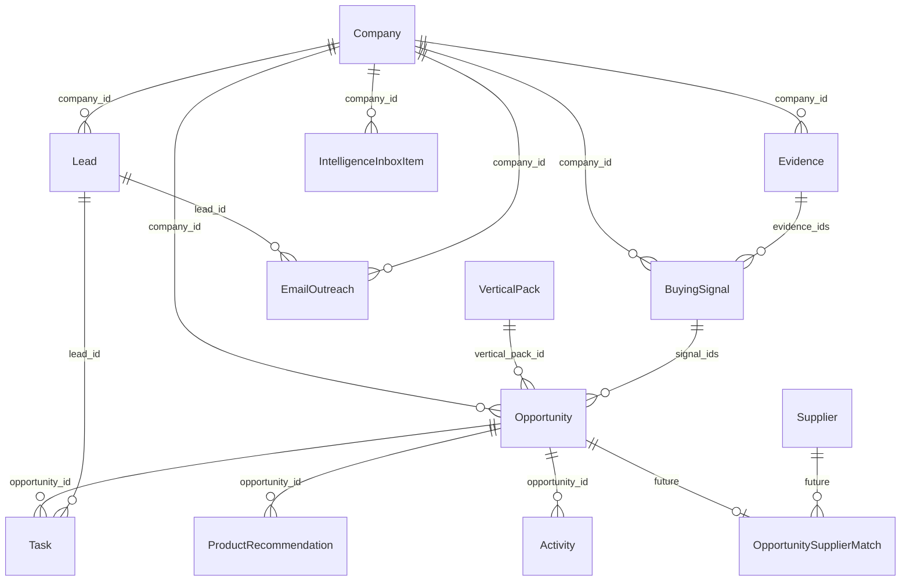

# 21 — Database Refactor (IPP V1)

**Constitution alignment:** Docs `03`, `11`, `12`, `20`.  
**Platform:** Base44 entities (no Postgres migration in V1).  
**Rule:** Additive, backward-compatible. Do not drop Lead columns.

---

## 1. Existing Entities

### 1.1 In-repo today

| Entity | Action |
|--------|--------|
| Lead | **KEEP** → evolve to Contact-centric; add `company_id` |
| EmailTemplate | **KEEP** |
| OutreachCampaign | **KEEP** |
| EmailOutreach | **KEEP**; prefer `company_id` + `lead_id` |
| EmailQueue | **KEEP** |
| InboxStats | **KEEP** |

### 1.2 Used but missing from git

| Entity | Action |
|--------|--------|
| Company | **KEEP** + **MODIFY** → industrial hub |
| Task | **KEEP**; commit schema; add optional `opportunity_id` |
| Activity | **KEEP**; commit schema; link company/opportunity |

---

## 2. Entities to KEEP (unchanged role)

- EmailTemplate, OutreachCampaign, EmailOutreach, EmailQueue, InboxStats  
- Task / Activity (CRM execution)  
- Lead (people + outreach targeting)

---

## 3. Entities to MODIFY

### 3.1 Company (hub for Path A + Path B)

**Purpose:** Single industrial organization. Both acquisition paths converge here.

| Field | Type | Notes |
|-------|------|-------|
| name | string | Legal/trade name |
| normalized_name | string | Dedup key |
| website | string | |
| domain | string | Dedup key |
| country | string | ISO preferred |
| industry_raw | string | Free text |
| vertical_pack_ids | string[] | Active packs |
| size | enum | Align Lead.company_size |
| description | string | Evidence-backed preferred |
| linkedin_url | string | |
| verification_status | enum | `unverified\|pending\|verified\|rejected` |
| verification_confidence | number | 0–1 |
| relationship_score | number | 0–100 (Path A) |
| relationship_score_updated_at | datetime | |
| path_a_status | enum | `observed\|verified\|nurtured\|customer\|churn_risk` |
| source_provenance | string | First discovery source type |
| tags | string[] | |
| notes | string | |
| duplicate_of_id | string | Merge pointer |
| # future | | |
| supplier_match_enabled | boolean | Default false (Supplier Intelligence later) |

**Indexes / uniqueness (logical):**  
`(domain, country)` unique when domain present; `(normalized_name, country)` soft unique.

### 3.2 Lead (Contact)

| Change | Detail |
|--------|--------|
| Add | `company_id` (required after migration backfill) |
| Keep | Contact + enrichment + WhatsApp + cadence fields |
| Deprecate (soft) | Using Lead as sole “deal”; deals live on Opportunity |
| Add | `evidence_ids` optional for contact provenance |
| Modify | `source` enum include `hubspot`, `discovery`, `referral`, `manual` |

**Rule:** Do not invent email/phone. Enrichment may suggest; store `verification_status` on contact fields if needed.

### 3.3 Task / Activity

| Change | Detail |
|--------|--------|
| Add | `company_id`, optional `opportunity_id` |
| Keep | `lead_id` for person tasks |

---

## 4. Entities to CREATE (V1)

### 4.1 VerticalPack

Config pack — **no redesign to add sectors**.

| Field | Notes |
|-------|-------|
| code | `industrial_water`, `food_processing`, `packaging`, `automotive`, `mining`, `furniture`, `medical_devices`, `electronics`, `energy`, `plastic_molds`, … |
| name | Display |
| discovery_source_ids | References / codes |
| buying_signal_codes | Subset of Doc 12 taxonomy |
| decision_maker_roles | Persona list |
| typical_equipment | string[] |
| typical_products | string[] |
| sales_cycle_days_min/max | |
| prompt_template_keys | |
| kpi_defs | JSON |
| score_weights | JSON overrides for Doc 11 |
| product_recommendation_rules | JSON (signal → products) |
| active | boolean |

**V1 seed:** `plastic_molds`, `industrial_water` (minimum).

### 4.2 Evidence

Per Doc 12 evidence model.

| Field | Notes |
|-------|-------|
| company_id | Required |
| opportunity_id | Optional |
| type | identity, location, project_mention, … |
| claim | Atomic statement |
| artifact_url | |
| artifact_hash | Optional |
| source_type | Doc 12 source catalog |
| source_weight | W |
| confidence | 0–1 |
| observed_at | |
| expires_at | |
| extractor | agent/human + version |
| raw_excerpt | Optional bounded text |
| status | `active\|expired\|quarantined` |

**Rule:** No Evidence without artifact reference OR explicit `manual_attestation` with user_id.

### 4.3 BuyingSignal

| Field | Notes |
|-------|-------|
| company_id | Required |
| code | Taxonomy code (Doc 12) |
| evidence_ids | string[] **required min 1** |
| confidence | 0–1 |
| observed_at | |
| vertical_pack_id | |
| geography | |
| intensity | soft\|medium\|strong |
| status | active\|expired\|dismissed |

### 4.4 Opportunity

Project-shaped commercial object (Path B → CRM).

| Field | Notes |
|-------|-------|
| company_id | Required |
| title | |
| summary | Evidence-based |
| vertical_pack_id | |
| timeline_stage | See §8 |
| opportunity_score | 0–100 |
| strategic_fit_score | 0–100 |
| confidence | 0–1 |
| estimated_value | number |
| currency | default USD |
| signal_ids | string[] |
| evidence_ids | string[] **required** |
| product_recommendation_ids | string[] |
| inbox_status | pending\|approved\|rejected\|needs_research\|nurture_only |
| reject_reason_code | |
| crm_promoted_at | |
| owner | user email |
| next_action | |

**Anti-fabrication:** Create/promote forbidden if `evidence_ids.length === 0`.

### 4.5 IntelligenceInboxItem

| Field | Notes |
|-------|-------|
| company_id | |
| opportunity_id | Optional draft |
| path | `A` \| `B` \| `AB` |
| priority_index | Computed |
| relationship_score_snapshot | |
| opportunity_score_snapshot | |
| strategic_fit_score_snapshot | |
| recommendation_summary | |
| status | pending\|approved\|rejected\|needs_research\|nurture_only |
| assignee | |
| decision_by | |
| decision_at | |
| decision_notes | |

### 4.6 ProductRecommendation

| Field | Notes |
|-------|-------|
| company_id | |
| opportunity_id | |
| product_code | From VerticalPack catalog |
| product_label | e.g. “RO Water Treatment” |
| rationale | |
| evidence_ids | **required** |
| signal_ids | **required** |
| confidence | |
| status | suggested\|accepted\|dismissed |

**Rule:** Recommendations never create Opportunities by themselves; they attach to evidence-backed Opportunity hypotheses.

### 4.7 LearningEvent (minimal V1)

| Field | Notes |
|-------|-------|
| type | approve\|reject\|win\|loss\|invalid_contact |
| inbox_item_id | |
| opportunity_id | |
| reason_code | |
| payload | JSON snapshot |
| created_at | |

### 4.8 Future: Supplier Intelligence (stubs only — NOT V1 logic)

Create empty/optional schemas or documented reserved names:

| Entity | Purpose (post-V1) |
|--------|-------------------|
| Supplier | Manufacturer / partner |
| SupplierCapability | Processes, machines, MOQ, lead time, industries, countries, certifications, references |
| OpportunitySupplierMatch | Opportunity → recommended suppliers |

**V1:** No matching engine, no UI. Fields on Company: `supplier_match_enabled` reserved.  
**Goal:** Avoid future redesign.

---

## 5. Relationships



---

## 6. Indexes (logical)

| Entity | Index |
|--------|-------|
| Company | domain+country; normalized_name+country; relationship_score; verification_status |
| Lead | company_id; email |
| Evidence | company_id; expires_at; source_type |
| BuyingSignal | company_id+code; observed_at |
| Opportunity | company_id; timeline_stage; inbox_status; opportunity_score |
| Inbox | status+priority_index |
| ProductRecommendation | opportunity_id |

---

## 7. Duplicate Prevention

| Layer | Rule |
|-------|------|
| Company | Match domain; else normalized_name+country; Inbox merge flow |
| Lead | Unique email per company when email present |
| Evidence | artifact_url+claim hash |
| Opportunity | Same company + overlapping evidence cluster within 30d → suggest merge |
| Signal | Same company+code+day → upsert intensity |

---

## 8. Opportunity Timeline

Canonical stages (ordered):

```text
signal → research → verified → qualified → quoted → negotiation → won → lost → repeat_business
```

| Stage | Meaning |
|-------|---------|
| signal | Hypothesis from signals; often pre-inbox or inbox pending |
| research | Analyst investigating |
| verified | Evidence policy passed |
| qualified | Sales accepts commercial pursuit |
| quoted | Formal quote submitted |
| negotiation | Active commercial negotiation |
| won | Closed-won |
| lost | Closed-lost |
| repeat_business | Expansion / next project from same company |

**Note:** Legacy Lead.status (`new…won`) remains for **contact/pipeline UI** during transition; Opportunity Timeline is source of truth for **projects**.

---

## 9. Source Provenance

Every Company, Evidence, Signal, Opportunity stores:

- `source_type` / first-touch provenance  
- links to Evidence  
- extractor version  

Manual entries require `created_by` + attestation note.

---

## 10. Score Fields (Doc 11)

Stored on Company / Opportunity; recomputed by Scoring Services.

### Relationship Score (Company, Path A) — 0–100

Factors: verified DMs, engagement recency/depth, content affinity, tenure, referral strength, commercial history (see Doc 11 §9.1).

### Opportunity Score (Opportunity, Path B) — 0–100

Factors: evidence strength, signal intensity, value band, timing, stakeholder clarity, competitive openness (Doc 11 §9.2).

### Strategic Fit Score (Opportunity) — 0–100

Factors: vertical pack match, offer capability, China suitability, geography, ticket size, partnership path (Doc 11 §9.3).

### Priority Index (Inbox)

`0.45·Opp + 0.35·Fit + 0.20·Rel` (weights overridable per VerticalPack).

---

## 11. Evidence Model (persistence summary)

See Doc 12 §4. DB must support confidence, freshness, expiry, quarantine, traceability to CRM promotion snapshots.

---

## 12. Future compatibility — Supplier Intelligence

| Now | Later |
|-----|-------|
| Reserved entities / flags | Matching Engine: Opportunity → SupplierCapability |
| No FK required in V1 | OpportunitySupplierMatch with score + rationale + evidence |

Do **not** overload Company to mean Supplier. Suppliers are separate parties.

---

## 13. KEEP / REFACTOR / REMOVE

| Item | Action |
|------|--------|
| Email/outreach entities | **KEEP** |
| Lead contact fields | **KEEP** |
| Company as name-only orphan | **REFACTOR** → hub |
| Opportunity-as-Lead-status | **REFACTOR** → Opportunity entity |
| Fabricated contacts in schema defaults | **REMOVE** |
| Supplier matching tables full logic | **Defer** |
