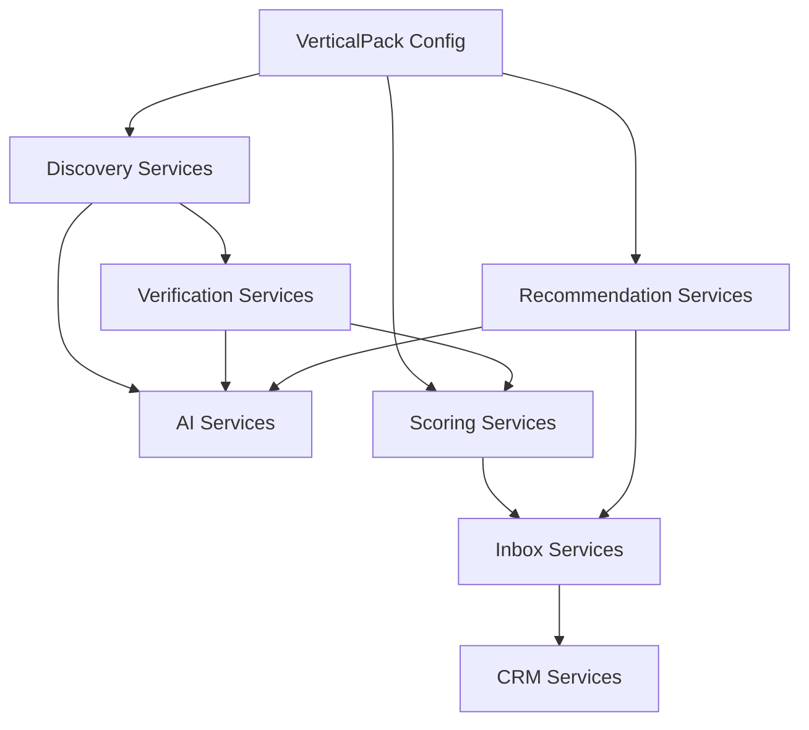

# 22 — Service Architecture (IPP V1)

**Constitution:** Docs `04`, `05`, `11`, `12`, `20`, `21`.  
**Platform:** Base44 Deno edge functions + thin client SDK calls.  
**Rule:** Modular services by responsibility. No monolith “do everything” function for IPP core.

---

## 1. Service map overview

```text
Discovery Services        Path A + Path B intake
Verification Services     Entity + evidence truth
Scoring Services          Rel / Opp / Fit / Priority
Recommendation Services   Product suggestions (evidence-bound)
CRM Services              Execution (existing + promote)
AI Services               Summarize/classify/extract only
Inbox Services            Approval gate
(Vertical Pack Config)    Cross-cutting configuration
(Supplier Matching)       POST-V1 only — boundary reserved
```

---

## 2. Discovery Services

### 2.1 `companyDiscover` (Path A)

| | |
|--|--|
| **Responsibility** | Create/update Company candidates from sources (website, import, registry, CRM backfill) |
| **Inputs** | source_type, artifact refs, name/website/country |
| **Outputs** | company_id, verification_status=`pending`\|`unverified`, provenance |
| **Dependencies** | Company entity, VerticalPack (optional tag) |
| **Errors** | 400 missing name; 409 duplicate candidate → return existing id |
| **Scale** | Batch import with concurrency cap |

**MUST NOT:** Fabricate domain, invent firmographics.

### 2.2 `decisionMakerDiscover` (Path A)

| | |
|--|--|
| **Responsibility** | Attach Lead/contacts to Company when published or dual-verified |
| **Inputs** | company_id, evidence or enrichment suggestion |
| **Outputs** | lead_id or quarantine suggestion |
| **Dependencies** | Existing apollo/hunter/enrichLead **with validators** |
| **Errors** | Reject invent-pattern emails |
| **Scale** | Reuse batch enrich caps (Doc 07/10) |

### 2.3 `evidenceIngest` (Path B)

| | |
|--|--|
| **Responsibility** | Persist Evidence records |
| **Inputs** | company_id, type, claim, artifact_url, source_type, observed_at |
| **Outputs** | evidence_id, confidence draft |
| **Dependencies** | Verification Services (async or sync) |
| **Errors** | 400 without artifact/attestation |

### 2.4 `signalDetect` (Path B)

| | |
|--|--|
| **Responsibility** | Classify BuyingSignals from Evidence (taxonomy Doc 12) |
| **Inputs** | evidence_id(s) |
| **Outputs** | signal records (min 1 evidence_id each) |
| **Dependencies** | AI classify + VerticalPack allowed codes |
| **Errors** | No signal without evidence link |

### 2.5 Existing functions (KEEP / adapt)

| Function | Role in V1 |
|----------|------------|
| enrichLead, apollo*, hunter*, apify*, scrape* | Path A assist — output suggestions, not truth |
| scanWebsiteWhatsApp | Path A channel discovery if published |
| syncLeadIQ, hubspotSync | Import provenance sources |

---

## 3. Verification Services

### 3.1 `companyVerify`

| | |
|--|--|
| **Responsibility** | Multi-source company verification; set verification_status |
| **Inputs** | company_id |
| **Outputs** | status, confidence, conflicts |
| **Dependencies** | Evidence, source weights |
| **Errors** | `needs_research` on conflict |

### 3.2 `evidenceVerify`

| | |
|--|--|
| **Responsibility** | Freshness, source weight, quarantine low quality |
| **Inputs** | evidence_id |
| **Outputs** | confidence, status |

### 3.3 `entityResolve`

| | |
|--|--|
| **Responsibility** | Duplicate detection / merge suggestions |
| **Inputs** | name, domain, country |
| **Outputs** | match candidates |

### 3.4 Conflict resolution

Per Doc 12 §6 — emit Inbox `needs_research` items; never silent destructive merge.

---

## 4. Scoring Services

### 4.1 `scoreRelationship` (Path A)

| | |
|--|--|
| **Responsibility** | Compute Company.relationship_score (Doc 11 §9.1) |
| **Inputs** | company_id |
| **Outputs** | score 0–100, factor breakdown |
| **Triggers** | Engagement, new DM, quarterly job |

### 4.2 `scoreOpportunity` (Path B)

| | |
|--|--|
| **Responsibility** | Opportunity.opportunity_score (Doc 11 §9.2) |
| **Inputs** | opportunity_id |
| **Outputs** | score + breakdown |

### 4.3 `scoreStrategicFit`

| | |
|--|--|
| **Responsibility** | strategic_fit_score (Doc 11 §9.3) + VerticalPack weight overrides |
| **Inputs** | opportunity_id, vertical_pack_id |

### 4.4 `scorePriority`

| | |
|--|--|
| **Responsibility** | Inbox priority_index = 0.45 Opp + 0.35 Fit + 0.20 Rel |
| **Inputs** | snapshots of three scores |

**KEEP:** Client `leadScoring.jsx` for legacy Lead UI until deprecated; do not conflate with IPP triad.

---

## 5. Recommendation Services

### 5.1 `recommendProducts` (V1)

| | |
|--|--|
| **Responsibility** | Suggest products/solutions from signals + VerticalPack rules |
| **Inputs** | company_id, signal_ids, evidence_ids, vertical_pack_id |
| **Outputs** | ProductRecommendation[] each with evidence_ids + signal_ids |
| **Example** | Signal `new_production_line` + beverage vertical → bottling line, RO, automation, conveyors, packaging, compressors, energy — **only if pack rules + evidence support** |
| **Errors** | Empty set if no rule matches; never invent Opportunity |

### 5.2 Future `matchSuppliers` (NOT V1)

| | |
|--|--|
| **Responsibility** | Opportunity → SupplierCapability matches |
| **V1** | Interface reserved; return `501 not implemented` if called |

---

## 6. CRM Services

### 6.1 Existing (KEEP)

| Service | Responsibility |
|---------|----------------|
| Lead/Task/Activity CRUD | Execution |
| Pipeline stage tasks | Sales process |
| smtpSendEmail / queue / trackEmailEvent | Outreach |
| sendTrackedEmail | Tracked campaigns |
| Templates / sequences UI backends | Nurture Path A |
| updateLeadTemperatures | Legacy temperature — later align to Relationship |

### 6.2 `inboxPromoteToCrm` (new)

| | |
|--|--|
| **Responsibility** | On Approve: ensure Company; create/update Opportunity timeline; link Leads; snapshot scores; LearningEvent |
| **Inputs** | inbox_item_id, decision |
| **Outputs** | opportunity_id, company_id |
| **Errors** | Block if no evidence_ids |
| **Dependencies** | Scoring snapshots, ProductRecommendation attach |

### 6.3 `hubspotSync`

**REFACTOR** contract (Doc 10 QW-1). Treat as provenance import/export — not intelligence fabricator.

---

## 7. AI Services

Cross-cutting; used by Discovery / Verification / Recommendation.

| Capability | Allowed | Forbidden |
|------------|---------|-----------|
| Summarize evidence | Yes | Add facts |
| Classify signals | Yes | Signal without evidence |
| Extract published contacts | Yes | Invent emails/phones |
| Compare / prioritize | Yes | Silent CRM write |
| Recommend products from rules+text | Yes | Invent projects/companies |
| Calculate scores | Yes | Override without audit |

**Implementation note:** Prefer server `InvokeLLM` with JSON schema; parameterize prompts via VerticalPack `prompt_template_keys` (Doc 05 REFACTOR).

**Existing:** enrichLead validators = **KEEP** as pattern for all extractors.

---

## 8. Inbox Services

### 8.1 `inboxList` / `inboxDecide`

| | |
|--|--|
| **Responsibility** | Queue Path A nurture candidates & Path B opportunities; apply decisions |
| **Inputs** | filters, decision enum + reason_code |
| **Outputs** | updated item; side effects promote/learn |
| **Error handling** | Reject missing reason on Reject |

### 8.2 Learning

`learningRecord` writes LearningEvent; weekly jobs may adjust VerticalPack weights (V1: store events only; auto-tune optional later).

---

## 9. Vertical Pack Config Service

`verticalPackGet` / `verticalPackList`

Returns sources, signals, products, weights, prompt keys.  
Adding Automotive / Mining / etc. = new pack record, **not** new architecture.

---

## 10. Error handling standard

| Code | When |
|------|------|
| 400 | Validation / missing evidence |
| 401/403 | Auth |
| 404 | Entity missing |
| 409 | Duplicate |
| 422 | Anti-fabrication rule |
| 500 | Upstream source failure (partial success allowed with warnings) |

All mutating IPP services: structured `{ ok, error, code, details }`.

---

## 11. Future scalability

| Pattern | Application |
|---------|-------------|
| Job queue entity (like EmailQueue) | Discovery crawls, batch verify |
| Concurrency caps | Enrichment / recommend |
| Pack-level rate limits | Source connectors |
| Snapshot scores | Avoid recompute storms |
| Supplier matching service boundary | Scale independently post-V1 |

---

## 12. Dependency diagram



---

## 13. KEEP / REFACTOR / REMOVE

| Item | Action |
|------|--------|
| SMTP, tracking, enrich validators | **KEEP** |
| Mold-hardcoded prompts | **REFACTOR** → VerticalPack templates |
| HubSpot panel contract | **REFACTOR** |
| Lead.create from raw scrape as default | **REMOVE** / gate via Inbox |
| Supplier matching | **Defer** |
