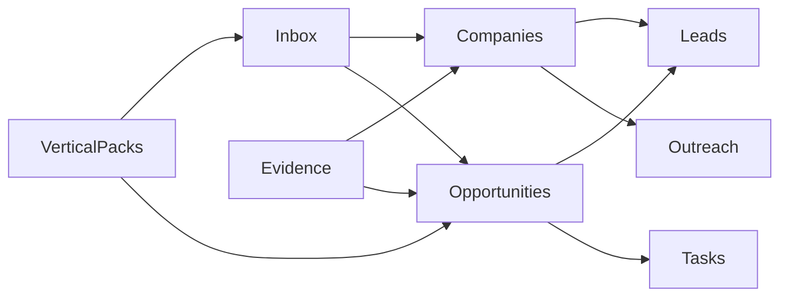

# 23 — UI Information Architecture (IPP V1)

**Constitution:** Docs `11`, `12`, `20`, `21`, `22`.  
**Constraint:** Define navigation, modules, hierarchy, workflows, journeys — **not** visual screen design.

---

## 1. Product framing in the UI

**Primary product:** Industrial Intelligence  
**Secondary product:** CRM execution  

Users should always see **which path** they are in:

| Path | User intent |
|------|-------------|
| **A — Market Intelligence** | Grow verified companies & relationships |
| **B — Opportunity Intelligence** | Work evidence-backed projects |
| **CRM** | Execute outreach, tasks, quotes |

---

## 2. Navigation (target IA)

### 2.1 Top-level modules

| Order | Module | Path | Purpose |
|------:|--------|------|---------|
| 1 | **Intelligence Inbox** | A+B | Approval gate (default home for intel users) |
| 2 | **Companies** | A+B hub | Company 360: relationship + opportunities |
| 3 | **Opportunities** | B | Project pipeline by Opportunity Timeline |
| 4 | **Evidence** | B | Evidence browser / attach |
| 5 | **Leads / Contacts** | CRM | People linked to companies |
| 6 | **Tasks** | CRM | Execution tasks |
| 7 | **Outreach** | CRM / A nurture | Email tracking |
| 8 | **Sequences / Templates** | CRM / A | Nurture & sales content |
| 9 | **Email Outreach** | CRM | SMTP queue |
| 10 | **Dashboard** | Exec | IPP KPIs (Doc 11) not vanity-only |
| 11 | **Vertical Packs** | Admin | Pack configuration (admin) |
| 12 | **Integrations** | Admin | HubSpot/LinkedIn honest status |

**KEEP** existing CRM pages; **REFACTOR** labels/home toward Inbox + Companies.

### 2.2 Deprecated as primary

- Treating **Leads** list as the only universe of “business.”  
- Fake “Connected” integration badges.

---

## 3. Information hierarchy

```text
Company
 ├─ Relationship Score (Path A)
 ├─ Path A status (observed → nurtured → customer)
 ├─ Contacts (Leads)
 ├─ Evidence[]
 ├─ Buying Signals[]
 ├─ Opportunities[]
 │    ├─ Opportunity Score / Strategic Fit
 │    ├─ Timeline stage
 │    ├─ Product Recommendations[] (each → evidence)
 │    └─ Tasks / Activities
 └─ Inbox history / Learning decisions
```

**Rule:** Opportunity never appears as orphan without Company.

---

## 4. Module responsibilities

### 4.1 Intelligence Inbox

- Queue ranked by Priority Index.  
- Show path badge (A / B / AB).  
- Actions: Approve, Reject (+ reason), Needs research, Nurture only, Merge duplicate.  
- Display evidence links, signals, three scores, recommendations.

### 4.2 Companies

- Search/filter: vertical, country, verification, relationship score.  
- Company 360 page is the **convergence UI**.  
- Path A actions: verify, add DM, newsletter enroll, quarterly touch.  
- Path B actions: add evidence, view signals, open opportunities.

### 4.3 Opportunities

- Board or list by **Opportunity Timeline** stages.  
- Not identical to legacy Lead kanban (keep Lead Pipeline for contact stages during transition).  
- Detail: scores, evidence, recommendations, CRM promote status.

### 4.4 Evidence

- Add evidence with mandatory artifact/attestation.  
- Filter expired/quarantined.  
- Jump to related signals/opportunities.

### 4.5 Leads / Contacts

- Always show parent Company.  
- Enrichment = suggest; UI must show provenance/confidence.  
- Block save of known-fabricated patterns (client + server).

### 4.6 Dashboard

IPP KPIs (Doc 11): verified companies, signals, projects discovered, qualified opps, pipeline value, confidence, meetings, quotes, revenue influenced — **not** only emails sent.

### 4.7 Vertical Packs (admin)

- Activate packs; edit recommendation rules; view signal subsets.  
- No code deploy required for new sector (config).

---

## 5. Primary workflows

### W1 — Path A: Add industrial company

1. Discover/import Company  
2. Verify  
3. Find decision makers (evidenced)  
4. Relationship Score updates  
5. Nurture (newsletter / quarterly)  
6. Optional Inbox “nurture only”

### W2 — Path B: Evidence to opportunity

1. Attach Evidence to Company  
2. Signals classified  
3. Opportunity hypothesis + scores + recommendations  
4. Inbox review  
5. Approve → Opportunity Timeline `verified`/`qualified`  
6. CRM execution (tasks, outreach, quote)

### W3 — Convergence

1. Open Company  
2. See Relationship Score and open Opportunities side by side  
3. Choose nurture vs pursue

### W4 — Reject learning

1. Reject Inbox item with reason code  
2. Item leaves queue  
3. LearningEvent recorded (visible to admin later)

### W5 — Legacy mold sale (KEEP)

1. Lead Pipeline / Outreach as today  
2. Prefer linking Lead → Company when present  
3. No requirement to invent Opportunity if pure tooling RFQ with manual attestation evidence

---

## 6. User journeys

### 6.1 Intelligence analyst

Inbox → Evidence → Company → Approve/Reject → done.

### 6.2 Sales executive

Inbox approved Opps → Opportunity detail → Contact → Sequence/Email → Tasks → Quote stages on Timeline.

### 6.3 Relationship owner (Path A)

Companies (high Rel, no Opp) → quarterly touch → Templates/Newsletter → score ↑.

### 6.4 Admin

Vertical Packs → Integrations → Dashboard KPIs → Learning reasons.

### 6.5 Future supplier manager (post-V1)

Opportunity → Supplier matches (module reserved; hidden in V1).

---

## 7. Relationship between modules



---

## 8. Permissions (IA-level)

| Role | Inbox | Packs admin | CRM |
|------|-------|-------------|-----|
| Analyst | Decide | No | Limited |
| Sales | View approved + CRM | No | Full |
| Admin | Full | Full | Full |

---

## 9. Non-goals for UI V1

- Pixel-perfect redesign of shadcn theme  
- Supplier matching screens  
- Replacing all Lead pages in one shot  
- Auto-send outreach on Approve without human

---

## 10. KEEP / REFACTOR / REMOVE

| Item | Action |
|------|--------|
| Outreach, Sequences, Templates, Tasks | **KEEP** |
| Companies page | **REFACTOR** → Company 360 |
| Leads as sole home | **REFACTOR** |
| Pipeline Lead kanban | **KEEP** transitional |
| Fake integration status | **REMOVE** |
| Supplier UI | **Defer** |
