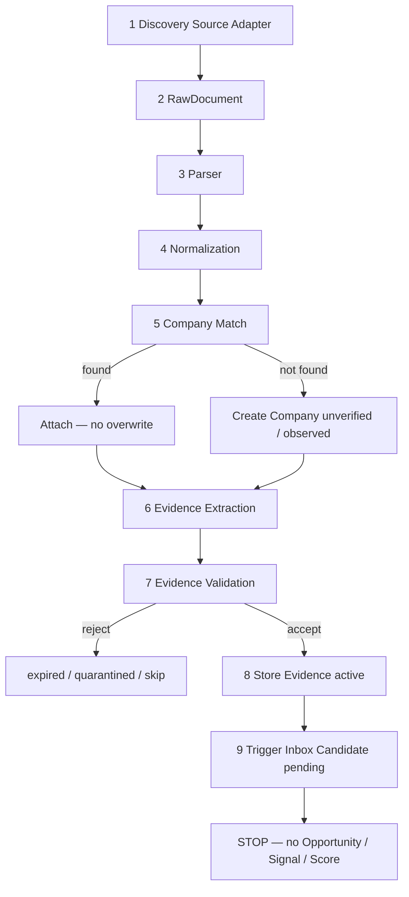

# Sprint 2.1 — Discovery Engine Foundation Report

**Sprint:** Discovery Engine Foundation  
**Date:** 2026-07-18  
**Scope:** Discover → normalize → store Evidence → queue Inbox candidate  
**Status:** Complete — fixture pipeline verified; app build verified  
**Constitution:** docs `12`, `11`, `33`, `25`, `22`, `27`

---

## 1. Discovery Architecture Report

### Purpose (this sprint)

Continuously collect industrial information and transform it into **structured Evidence** attached to **Companies**. Queue **pending** `IntelligenceInboxItem` records for later human review.

### Explicitly out of scope

| Forbidden | Status |
|-----------|--------|
| Opportunity creation | Not implemented |
| BuyingSignal generation | Not implemented |
| AI / LLM extraction | Not implemented |
| Product recommendations | Not implemented |
| Email / CRM automation | Not implemented |
| Supplier matching | Not implemented |
| Scoring (Rel / Opp / Fit) | Not implemented |
| Real cron / scrape engines | Interface only |

### Architecture compliance

| Rule | Implementation |
|------|----------------|
| No new persistence entities | Uses `Company`, `Evidence`, `IntelligenceInboxItem` only |
| Evidence requires provenance | `artifact_url` **or** `manual_attestation` + `attested_by` |
| New companies | `verification_status=unverified`, `path_a_status=observed` |
| Never overwrite Company | Match attaches evidence; create only when no safe match |
| Never auto-merge uncertain | Ambiguous name matches → create separate observed company |
| Inbox gate | `status=pending` only; no Opportunity / scores |
| Discovery event taxonomy | Pipeline categories map onto frozen `Evidence.type` enums |

### Discovery event → Evidence.type mapping

Industrial claim categories (Sprint request) are **not** a new entity. They map to frozen `Evidence.type` (`Evidence.jsonc` / docs `33`):

| Discovery event | Evidence.type |
|-----------------|---------------|
| factory_expansion | project_mention |
| tender | project_mention |
| investment | financial_investment |
| hiring | operational |
| new_product_line | firmographic |
| equipment_purchase | trade |
| environmental_permit | project_mention |
| government_funding | financial_investment |
| factory_construction | project_mention |
| production_increase | operational |
| certification | operational |
| export_activity | trade |
| other | media |

Event code is retained in `extractor` (`discovery-pipeline@2.1.0\|event:<code>`) for Sprint 2.2+ signal classification.

### Module isolation

All discovery logic lives under `src/discovery/`. Repositories are injected (memory for tests; Base44 adapters for runtime). Core has **no** SDK import dependency.

---

## 2. Pipeline Diagram



```text
RSS | XML | CSV | JSON API | Manual Upload | HTML
        ↓
   RawDocument { content, source, fetched_at, source_id }
        ↓
   ParsedRecord[]
        ↓
   NormalizedRecord (name, domain, country, dates, currency, units, phone, email, sectors)
        ↓
   Company match | create
        ↓
   Evidence draft (claim + provenance + confidence)
        ↓
   Validate → Store → IntelligenceInboxItem(pending)
```

---

## 3. Files Created

| Path | Role |
|------|------|
| `src/discovery/index.js` | Public API barrel |
| `src/discovery/types.js` | Types, event taxonomy, thresholds |
| `src/discovery/adapters/index.js` | RSS/XML/CSV/JSON/Manual/HTML adapters |
| `src/discovery/parser/index.js` | Deterministic parsers |
| `src/discovery/normalization/index.js` | Company/field normalization |
| `src/discovery/verification/companyMatch.js` | Match / create Company |
| `src/discovery/verification/validateEvidence.js` | Validation rules |
| `src/discovery/pipeline/index.js` | Full 9-stage pipeline |
| `src/discovery/pipeline/extractEvidence.js` | Evidence extraction |
| `src/discovery/pipeline/logger.js` | Stage logging |
| `src/discovery/scheduler/index.js` | Manual + future cron/webhook/queue |
| `src/discovery/services/inboxCandidate.js` | Pending inbox only |
| `src/discovery/services/memoryRepos.js` | In-memory repos (tests) |
| `src/discovery/services/persistence.js` | Base44 repo adapters |
| `src/discovery/fixtures/sample.rss.xml` | RSS fixture |
| `src/discovery/fixtures/sample.csv` | CSV fixture |
| `src/discovery/fixtures/sample.json` | JSON API fixture |
| `src/discovery/fixtures/manual-upload.json` | Manual attestation fixture |
| `src/discovery/tests/run-fixtures.mjs` | End-to-end fixture runner |
| `docs/SPRINT_2_1_DISCOVERY_FOUNDATION_REPORT.md` | This report |

### Modified

| Path | Change |
|------|--------|
| `package.json` | Added `test:discovery` script |

### Not modified (by design)

- No new Base44 entities  
- No CRM / Lead.create paths  
- No BuyingSignal / Opportunity / Recommendation logic  
- No AI prompts  

---

## 4. Pipeline Flow

| Stage | Input | Output | Testable unit |
|-------|-------|--------|---------------|
| 1 Discovery Source | adapter kind + input | RawDocument | `runAdapter` / `stages.discoverySource` |
| 2 Raw Document | — | RawDocument metadata | adapter return shape |
| 3 Parser | RawDocument | ParsedRecord[] | `parseRawDocument` |
| 4 Normalization | ParsedRecord + source | NormalizedRecord | `normalizeRecord` |
| 5 Company Match | NormalizedRecord | Company (matched \| created) | `matchOrCreateCompany` |
| 6 Evidence Extraction | Normalized + Company | Evidence draft | `extractEvidence` |
| 7 Evidence Validation | Evidence draft + existing | accept \| reject | `validateEvidence` |
| 8 Store Evidence | accepted Evidence | persisted Evidence | `repos.evidence.create` |
| 9 Inbox Candidate | Company + Evidence | IntelligenceInboxItem `pending` | `triggerInboxCandidate` |

### Validation outcomes

| Condition | Result |
|-----------|--------|
| Duplicate (artifact_hash / claim+url) | reject — not stored |
| Expired (`expires_at` &lt; now) | `expired` |
| Invalid URL | `quarantined` |
| Missing company | `quarantined` |
| Confidence &lt; 0.35 | `quarantined` |
| Missing provenance | `quarantined` |
| Passes all checks | `active` → inbox `pending` |

### Scheduler

| Method | Behavior |
|--------|----------|
| `runManual` | Executes pipeline immediately |
| `scheduleCron` | Registers job + optional hook (no OS cron) |
| `registerWebhook` | Interface registration |
| `enqueue` | Interface for future queue worker |

---

## 5. Test Results

Command: `npm run test:discovery` (`node src/discovery/tests/run-fixtures.mjs`)

```text
=== Results: 40 passed, 0 failed ===
```

Coverage exercised:

- Normalization (name, domain, no invented domain)  
- Evidence validation (low confidence, missing provenance)  
- Full pipeline: RSS, CSV, JSON API, Manual Upload  
- Existing Company match without overwrite  
- New Company `unverified` / `observed`  
- Duplicate evidence rejection  
- Scheduler manual + cron registration interface  
- Stage isolation (`stages.*`)  
- No Opportunity created  

Build: `npm run build` — verified after implementation.

---

## 6. Remaining Work for Sprint 2.2

Aligned with backlog / Discovery roadmap (next increments after foundation):

| Item | Notes |
|------|-------|
| `evidenceIngest` Base44 function | Auth-gated API wrapping pipeline / Evidence create; reject without artifact |
| Wire Base44 repos in edge function | Use `services/persistence.js` against live entities |
| VerticalPack seed | `plastic_molds`, `industrial_water` (backlog Sprint 2.1 naming) |
| Source catalog weights per pack | Apply docs `27` W overrides in adapter input |
| HTML adapter depth | Structured page extract beyond meta/title (still no AI) |
| Real fetch for RSS/JSON URLs | Network I/O behind adapter framework |
| Cron / queue worker | Implement hooks registered in scheduler |
| Evidence UI (minimal) | Later sprint — list/create on Company |
| `signalDetect` | **After** Evidence foundation — BuyingSignal only with evidence_ids |
| Expiry job | Periodic mark `expired` from soft/hard policy |

**Still forbidden until scheduled:** AI extraction, Opportunity promote, recommendations, email outreach from discovery.

---

## Definition of done checklist

- [x] Discovery module isolated under `src/discovery/`  
- [x] Modular 9-stage pipeline  
- [x] Adapters: RSS, XML, CSV, JSON API, Manual Upload, HTML (framework)  
- [x] Normalization + company match rules  
- [x] Evidence only + validation statuses  
- [x] Inbox candidate `pending` only  
- [x] Scheduler interface  
- [x] Stage logging  
- [x] Fixtures + tests green  
- [x] Repository compiles (`npm run build`)  
- [x] No architecture redesign / no new entities / no forbidden features  

---

**End of Sprint 2.1 report.**
